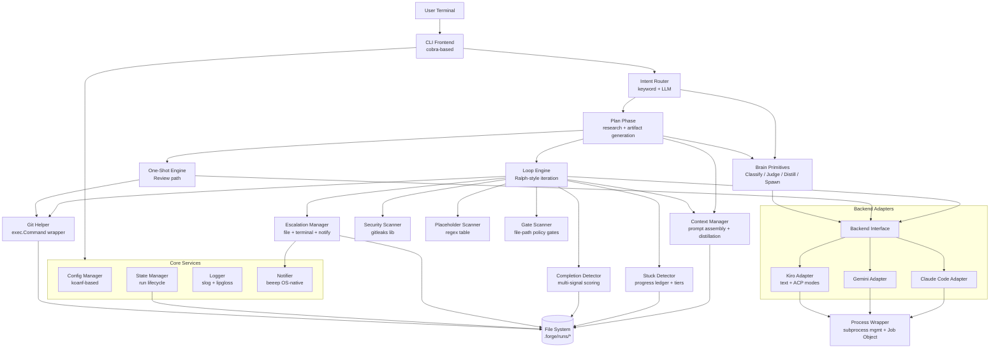
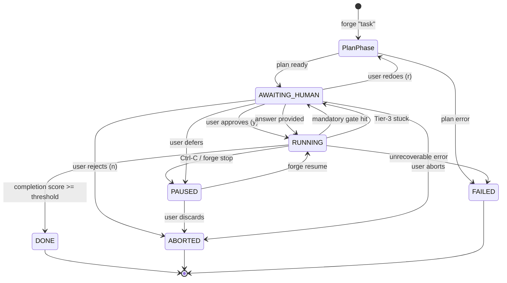
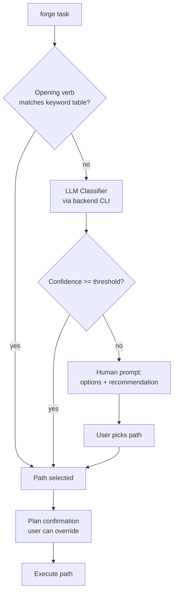
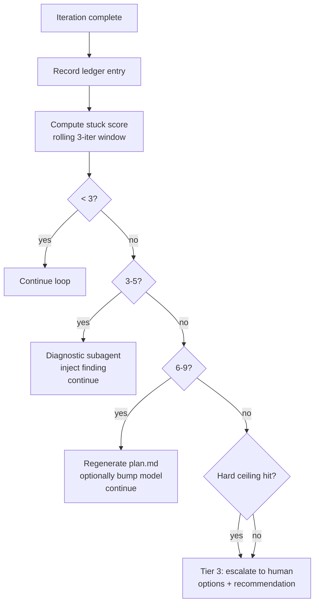
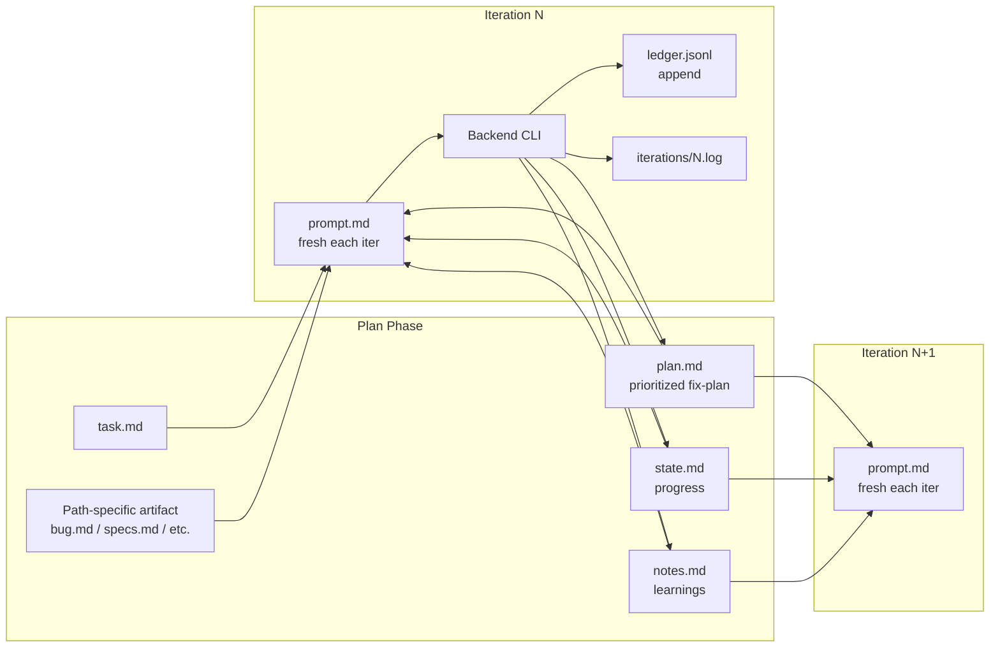

# Forge — Detailed Design Document

**Status:** v1 design, locked for implementation
**Date:** 2026-04-16
**Stand-alone doc:** this document contains everything needed to build Forge v1 without reading other project files.

---

## Table of Contents

1. [Overview](#1-overview)
2. [Detailed Requirements](#2-detailed-requirements)
3. [Architecture Overview](#3-architecture-overview)
4. [Components and Interfaces](#4-components-and-interfaces)
5. [Data Models](#5-data-models)
6. [Error Handling](#6-error-handling)
7. [Testing Strategy](#7-testing-strategy)
8. [Appendix A — Technology Choices](#appendix-a--technology-choices)
9. [Appendix B — Research Findings](#appendix-b--research-findings)
10. [Appendix C — Alternative Approaches](#appendix-c--alternative-approaches)

---

## 1. Overview

### 1.1 What Forge is

Forge is a single-binary CLI tool that **orchestrates long-running AI coding tasks** by driving existing AI CLI backends (Claude Code, Gemini CLI, Kiro CLI) in a Ralph-style loop with automated context management, stuck-loop prevention, and a minimal human-intervention policy.

The core invocation is one line:

```
forge "Create a REST API for managing todos"
forge "Fix the login redirect on 2FA"
forge "Review the auth module for security issues"
```

From that single input, Forge:
1. Detects intent from the opening verb and routes to one of 5 paths (Create / Add / Fix / Refactor / Review).
2. Researches the codebase and drafts a plan (using subagents for parallel reconnaissance).
3. Shows the plan with a single confirmation gate.
4. On approval, runs a Ralph loop (or a one-shot for Review) — with automatic context management, stuck detection, and per-iteration auto-commits on a safe branch.
5. Escalates to the human only when a decision is genuinely required.
6. Completes with a summary + suggested push/PR actions (never auto-executed).

### 1.2 Key differentiators vs. prior art

| Prior art | What Forge takes | What Forge does differently |
|---|---|---|
| **Ralph (ghuntley)** | Per-iteration context reset; fix_plan.md pattern; subagents for fan-out | Adds runtime orchestration (stuck detection, automatic distillation, escalation), programmatic safety gates, path specialization |
| **ralph-orchestrator** | Multi-backend ambition; Ralph-loop engine concept | No explicit `ralph.yml` authored by users — Forge writes it internally and hides it; no Rust toolchain requirement; narrower backend scope (3 vs. 7) |
| **get-shit-done (GSD)** | Context externalization to markdown; parallel subagents; atomic commits | One command not 40+; AI decides instead of walking user through phases; not a skill pack — a binary |

### 1.3 Design principles

1. **AI decides, human escalates only when necessary.** Every decision point follows a 4-step ladder: keyword fast-path → LLM classifier → human prompt (options + recommendation) → final safety-net confirmation.
2. **Minimal CLI surface.** ~11 commands total in v1. One primary verb; the rest are lifecycle/control.
3. **Minimal human burden.** No wizard. No upfront config beyond one-time backend selection. Plan phase does the research; human approves once.
4. **Safety before speed.** Mandatory gates on destructive/external/security-sensitive actions are non-overridable.
5. **Fresh context per iteration.** Ralph's discipline; no accumulating context in the main loop.
6. **State on disk, not in memory.** Every run is a resumable directory. Forge is invocation-based, not a daemon.
7. **One active run per repo, serial.** Simplicity trumps concurrency for v1.
8. **Fail graceful, log loud.** Structured logs + per-iteration transcripts + explicit `forge doctor`.

---

## 2. Detailed Requirements

Consolidated from the full idea-honing Q&A.

### 2.1 Functional requirements

#### 2.1.1 Primary command surface

- `forge "<task>"` — research → plan → confirm → execute → complete. Intent detected from opening verb.
- `forge plan "<task>"` — dry-run: stops after plan is printed. Same research as `forge "<task>"`.
- `forge status [--verbose] [--run <id>]` — current run state or any past run's state.
- `forge stop` — gracefully stop the active run; state preserved for resume.
- `forge resume [<run-id>]` — resume a paused or awaiting-human run.
- `forge history [--full]` — list past runs with summaries.
- `forge show <run-id> [--iter N]` — dump run artifacts; with `--iter N`, the per-iteration transcript.
- `forge clean` — delete terminal-state runs older than retention threshold.
- `forge backend [set <name>]` — view or change the configured backend.
- `forge config [get|set|unset|edit] [args]` — read/write configuration.
- `forge doctor` — read-only diagnostics; never auto-fixes.
- `forge --version`, `forge --help`, `forge <command> --help` — standard.

Global flags: `--verbose`, `--quiet`, `--json`, `--yes`, `--auto-resolve {accept-recommended|abort|never}`, `--timeout <duration>`, `--path <name>`, `--branch <name>`, `--no-branch`, `--brain {api|cli}` (CLI-only in v1, flag reserved), `--backend <name>`.

#### 2.1.2 Path system (10 paths in v1)

**Loop-lifecycle paths (6):**

| Path | Trigger verbs | Lifecycle | Completion criteria |
|---|---|---|---|
| **Create** | create, build, generate, make, scaffold, start, initialize, bootstrap, new | Ralph loop | Specs met + build + tests pass + placeholder-free |
| **Add** | add, implement, extend, introduce, support, enable, integrate | Ralph loop (brownfield-safe) | Feature integrated + tests pass + no regressions |
| **Fix** | fix, debug, repair, resolve, patch, address, troubleshoot | Ralph loop (diagnostic-first) | Bug no longer reproduces + regression test added |
| **Refactor** | refactor, restructure, rename, reorganize, simplify, cleanup, modernize, tidy, rewrite | Ralph loop (behavior-preserving) | Target shape achieved + tests still pass + invariants hold |
| **Upgrade** | upgrade, migrate, bump, update | Ralph loop (dep-gate-inverted) | Target version reached + all tests pass + regression list empty |
| **Test** | test, cover, "add tests for", "write tests for" | Ralph loop (scope-restricted to test files) | Coverage target met + all new tests pass + no existing test regressions |

**One-shot paths (4):**

| Path | Trigger verbs | Lifecycle | Output |
|---|---|---|---|
| **Review** | review, audit, analyze, inspect, check, critique, examine, assess | One-shot + parallel subagents | `report.md` with findings; no code changes |
| **Document** | document, "write docs for", "add docs to", describe | One-shot + parallel subagents | Docstrings inserted + markdown files written |
| **Explain** | explain, "walk me through", "how does", "what does" | One-shot (parallel subagents if scope warrants) | `explanation.md` (read-only; no commits) |
| **Research** | research, investigate, "find out", "look into" | One-shot (web-allowed, parallel subagents) | `research-report.md` (read-only; no commits) |

**Path-specific pre-loop gates:**
- **Refactor** — confirm behavioral invariants Forge will preserve (before loop starts).
- **Upgrade** — confirm source version → target version + acknowledge which dep manifests Forge is expected to modify during the run (inverts the normal dep-manifest hard-stop gate for this run only).

**Mode-restricted behavior:**
- **Test** — Forge may only modify test files + test infrastructure (`jest.config.js`, `pytest.ini`, coverage config). Any proposed production-code modification (even "export this so I can test it") triggers a mandatory escalation with options: `[m] modify with confirmation · [s] skip this test · [a] abort`.
- **Upgrade** — dep-manifest changes are expected (not a gate hit). Lockfile regeneration is expected. Other mandatory gates (secrets, protected branches, CI files, external-facing actions) still apply.
- **Explain / Research** — read-only modes. No commits. Outputs only to `explanation.md` / `research-report.md` + stdout.

#### 2.1.3 Intent detection (4-step ladder, canonical pattern)

```
1. Keyword match on opening verb       → path selected (fast)
2. LLM classifier via backend CLI      → path selected (research)
3. LLM low-confidence or tie           → human prompt: options + recommendation
4. Plan-confirmation checkpoint        → user sees path and can override
```

Escape hatch: `--path <name>` flag for explicit override.

#### 2.1.4 Backend support

- **Three backends:** Claude Code, Kiro CLI, Gemini CLI.
- **Manual selection:** always prompt on first run (never silent auto-select).
- **Backend selection per run:** default from `config.backend.default`; override with `--backend <name>`.
- **Brain (meta-LLM calls):** uses the configured backend CLI — no separate Anthropic API key in v1.

#### 2.1.5 Plan phase

Between `forge "<task>"` invocation and the confirmation prompt:
1. Detect path.
2. Research: codebase scan (brownfield paths), specs/docs reading, prior-art identification. Spawn parallel subagents.
3. Produce path-specific artifacts (see §5).
4. Render confirmation summary with: plan summary, path-specific highlights, estimated iteration count (range), active hard ceilings, keystroke prompt (`y/n/e/r`).

Auto-pre-gates: dirty-tree detection, protected-branch detection (see §4.8).

#### 2.1.6 Loop execution (looped paths)

Each iteration, in order:
1. Assemble `prompt.md` (composition order §4.4).
2. Run backend CLI one-shot with hybrid output protocol (streaming JSON preferred).
3. Capture per-iteration transcript and structured events.
4. Auto-commit if files changed (Forge-drafted message + Run-Id trailer).
5. Update iteration ledger with progress signals.
6. Run stuck-detection pass; take graduated action.
7. Run completion-detection pass; if score ≥ threshold, exit and finalize.
8. Run automatic distillation if any artifact exceeds threshold.
9. Emit terminal summary line.

#### 2.1.7 Context management

- **Per-iteration reset:** fresh backend invocation; no continuing session.
- **Token budget per iteration:** `effective_window − reserved_response − safety_margin`. Tracked per backend.
- **Automatic distillation triggers:** `state.md` > 8k tokens, `notes.md` > 10k, `plan.md` > 6k. Distillation via cheap backend-CLI subagent call between iterations.
- **Subagent spawning** for: codebase search, independent parallel subtasks, expensive reasoning, plan-phase research. Cap: 3–8 parallel subprocesses.
- **Emergency compression:** mid-iteration context exhaustion → abort (git stash) → distill → regenerate prompt → retry.

#### 2.1.8 Stuck detection (multi-signal, 4 tiers)

**Progress ledger per iteration:** files_changed, plan_items_delta, state_semantic_delta, build_status, test_status, regressions, error_fingerprint, agent_self_report, tokens_used (for context-budget tracking only), external_signal_deaths (count of subprocess deaths from OS signals — distinguished from Forge-initiated kills).

**Two-class scoring.** Signals split into *hard* (any single trigger → direct-to-tier) and *soft* (additive sum over rolling 3-iter window, gated by threshold). **Final tier = `max(hard_triggered_tier, soft_sum_tier)`.** This avoids the pathology where a persistent failing build trivially re-triggers plan regeneration every iteration.

**Hard signals** (single occurrence forces the listed tier):

| Signal | Predicate | Tier |
|---|---|---|
| `off_topic_drift_detected` | LLM judge says agent is working outside task.md scope | Tier 2 |
| `placeholder_accumulation_detected` | Placeholder scanner (§4.10) finds new high-confidence stubs in diff | Tier 2 |
| `same_error_fingerprint_4plus` | Last 4 iterations all have identical non-null error_fingerprint | Tier 3 |
| `build_broken_5plus` | Last 5 consecutive iterations have `build_status = fail` | Tier 3 |

**Soft signals** (additive; sum gated by threshold):

| Signal | Predicate | Weight |
|---|---|---|
| `no_files_changed_in_window` | `all(len(e.files_changed)==0 for e in window)` | +2 |
| `no_plan_items_closed_in_window` | `all(e.plan_items_completed==[] for e in window)` | +2 |
| `no_state_semantic_delta_in_window` | `all(e.state_semantic_delta.changed==false for e in window)` | +2 |
| `test_regression_introduced` | Current iteration introduces test regression vs. previous | +3 |
| `agent_self_reports_stuck` | Current iteration's `agent_self_report == "stuck"` | +2 |

**Soft-sum thresholds:**

| Soft sum | Soft tier |
|---|---|
| < 3 | Tier 0 (progressing) |
| 3–5 | Tier 1 (soft stuck) |
| ≥ 6 | Tier 2 (hard stuck) |

**Graduated tier actions:**

| Final tier | Action |
|---|---|
| 0. Progressing | Continue normally |
| 1. Soft stuck | Diagnostic subagent (via Brain) → inject finding into `state.md` → continue |
| 2. Hard stuck | Regenerate `plan.md` from scratch (Ralph's delete-the-TODO pattern); continue |
| 3. Dead stuck | Pause + escalate to human with diagnostic report + options + recommendation |

**Absolute hard ceilings** (any triggers immediate Tier 3 regardless of scoring):
- `max_iterations` (default 100; primary cap)
- `max_duration` (default 4h; wall-clock safety rail)
- `same_error_fingerprint_4plus` (hard signal above)
- `build_broken_5plus` (hard signal above)

**External-signal subprocess deaths are NOT stuck events.** If the backend subprocess exits from an OS signal that Forge didn't send (SIGCONT after suspend, SIGHUP on terminal disconnect, SIGPIPE, SIGSEGV from OS OOM) — Forge classifies this as an external death, logs, and transparently retries the iteration with the same prompt. Not counted in the ledger's stuck signals. Limit: 3 external deaths per iteration before escalating as a separate "environment instability" Tier-3 type.

**Rate-limit ≠ stuck.** Backend rate-limit responses (Claude `api_retry` with `error: rate_limit`, Gemini HTTP 429 in `error` field, Kiro exit 1 with rate indication) trigger `pause + exponential backoff` (30s → 60s → 120s → 300s, capped at 10m) *outside* the stuck-detection accounting. After 4 failed retries, escalate as "rate-limit exhaustion" Tier-3 — distinct from "dead stuck."

**Cost management is deferred to post-v1.** V1 does not enforce a USD budget — users rely on their backend's native dashboards/quotas for dollar-level control. The iteration count is the single primary loop-control knob; wall-clock duration is a secondary runaway safeguard. Rationale: the three backends have incompatible cost-reporting semantics (Claude Code emits USD, Gemini emits tokens only, Kiro emits credits), and a unified USD ceiling built on a synthetic conversion table would be a safety promise Forge can't reliably keep. Defer until the cost-normalization story can be designed honestly.

#### 2.1.8.1 Worked examples of stuck scoring

**Example A — Normal progress (Tier 0).**

| Iter | files_changed | plan_items_closed | build | test | error_fp |
|---|---|---|---|---|---|
| 1 | [src/foo.go] | 1 | pass | pass | — |
| 2 | [src/foo.go, src/foo_test.go] | 2 | pass | pass | — |
| 3 | [src/bar.go] | 0 | pass | pass | — |

Hard signals: none fire. Soft sum: `no_files_changed_in_window = false`, `no_plan_items_closed_in_window = false`, `no_state_semantic_delta_in_window = false`, `test_regression = false`, `self_report = progressing` → soft sum = 0. **Tier 0 → Continue.**

**Example B — Soft stuck with autonomous recovery (Tier 2 via soft sum).**

| Iter | files_changed | plan_items_closed | state_delta | self_report |
|---|---|---|---|---|
| 1 | [] | 0 | false | stuck |
| 2 | [] | 0 | false | stuck |
| 3 | [] | 0 | false | uncertain |

Hard signals: none. Soft sum: `no_files_changed (+2) + no_plan_items_closed (+2) + no_state_semantic_delta (+2) + self_report_stuck (+2, current iter)` = **8**. Soft tier = 2. **Tier 2 → regenerate plan.md from scratch; continue.**

**Example C — Hard stuck from error repetition (Tier 3 via hard signal).**

| Iter | build | error_fp |
|---|---|---|
| 1 | fail | "f3a2b81c" |
| 2 | fail | "f3a2b81c" |
| 3 | fail | "f3a2b81c" |
| 4 | fail | "f3a2b81c" |

Hard signal `same_error_fingerprint_4plus` fires immediately on iter 4. Soft sum irrelevant (hard gate dominates). **Tier 3 → pause + escalate** with options: pivot / reset-to-last-green / split task / abort. `build_broken_5plus` would also fire one iteration later if unabated.

#### 2.1.9 Completion detection (multi-signal, scored)

Weighted signals: agent sentinel `TASK_COMPLETE` (+3), build passes (+2), tests pass (+2), path-specific programmatic (+2), plan items all closed (+2), LLM judge high-confidence (+3), medium (+2), **judge-says-incomplete (−4)** veto.

Thresholds:
- ≥ 8 with judge ≥ medium → declare complete, finalize.
- 5–7 → one more "audit for placeholders" iteration.
- < 5 → continue normally.

**Placeholder scan** runs before declaring complete (gitleaks-style pattern match on diff, see §4.10). Hits reduce score by 4.

#### 2.1.10 Human-intervention policy (mandatory gates)

**Never auto-decided:**
- Initial task submission (by definition)
- Plan confirmation (unless `--yes`)
- Tier-3 stuck-loop escalation
- Destructive git (`push --force`, `reset --hard` on user-visible branches, `branch -D`, `clean -fd`)
- Git push to remote
- Create/close PRs, issues, comments
- Sending messages (Slack/email/etc.)
- Installing system packages
- Detected secret in diff (hard stop)
- Writes to protected branches
- Mid-loop scope change by user
- **Path-specific pre-loop gates:**
  - **Refactor** — confirm behavioral invariants pre-loop.
  - **Upgrade** — confirm source→target version pre-loop; dep-manifest gate is **inverted** for the run (changes expected, not escalated).
- **Test mode production-code touch gate** — Test mode may modify ONLY test files + test infrastructure. Any proposed production-code modification triggers a mandatory escalation: `[m] modify with confirmation · [s] skip this test · [a] abort`.
- **Policy-gate file classes** — detected by path-based `GateScanner` (see §4.10). Any modification to files in these classes halts the iteration and escalates:
  - **Dependency manifests** (any change → stop **except in Upgrade mode**): `package.json`, `Cargo.toml`, `go.mod`, `Gemfile`, `pyproject.toml`, `requirements.txt`, `requirements-*.txt`, `composer.json`, `setup.py`, `setup.cfg`, `Pipfile`, `environment.yml`, `Podfile`, `build.gradle`, `build.gradle.kts`, `pom.xml`, `deno.json`.
  - **Lockfiles** (pure lockfile-only change → auto-OK when tests pass; manifest+lockfile combo → stop): `package-lock.json`, `yarn.lock`, `pnpm-lock.yaml`, `Cargo.lock`, `go.sum`, `Gemfile.lock`, `poetry.lock`, `uv.lock`, `composer.lock`, `Podfile.lock`.
  - **CI/CD pipelines** (any change → stop): `.github/workflows/**`, `.gitlab-ci.yml`, `azure-pipelines.yml`, `.circleci/config.yml`, `.travis.yml`, `Jenkinsfile`, `.drone.yml`, `bitbucket-pipelines.yml`, `buildkite.yml`, `.buildkite/**`, `.gitlab/ci/**`, `cloudbuild.yaml`, `codefresh.yml`.
  - **Secrets / env** (any change → stop): `.env`, `.env.*`, `*.pem`, `*.key`, `secrets.yaml`, `secrets.yml`, `*.secret`, `credentials.json`, `service-account*.json`.
  - Per-repo override via `config.yml` `gates.additional_*` fields (see §5.2).
  - Semantic major/breaking detection (semver comparison, transitive analysis) deferred to post-v1.

**Escalation after research fails (tier-based):** path selection, backend selection, ambiguous completion, conflicting design alternatives, merge conflicts, ambiguous test failure, unknown build command.

**Interrupt-on-demand:** Ctrl-C, `forge stop`, `.forge/current/INTERRUPT` file flag.

#### 2.1.11 Escalation UX

**Two-file mailbox protocol** (single-writer-per-file eliminates races between Forge's writes and the user's editor saves):
- **Forge writes only** `.forge/current/awaiting-human.md` — the escalation question, atomically written (shim: `renameio` on Unix, `natefinch/atomic` on Windows).
- **User writes only** `.forge/current/answer.md` — the response, in a strict format with `id:` matching the current escalation + `answer: <letter>` + `---` terminator.
- **Forge watches the parent directory** (not individual files — single-file fsnotify watches die on atomic-rename editor saves). Filter by exact basename match. Ignore editor sidecars: `^\..*`, `.*~$`, `.*\.sw[a-p]$`, `.*___jb_(tmp|old)___$`, `^#.*#$`, `^4913$`.
- **Debounce 250ms** + size-stability check (`os.Stat` twice 20ms apart) before parsing.
- **Id mismatch:** rename stale user answer to `answer.stale.md` with timestamp; log; continue waiting for matching id.
- **CRLF normalization:** `strings.ReplaceAll(content, "\r\n", "\n")` before parsing.
- **On successful consume:** atomically delete `answer.md`.
- **Network-FS fallback** (detected via `statfs`): 2-second polling instead of fsnotify.

**Layered notification cascade** — at every escalation, Forge fires all channels in order, unconditionally. Every channel's success/failure is recorded in `forge.log`:

1. Write `awaiting-human.md` atomically (permanent record).
2. Write `.forge/current/ESCALATION` sentinel file (1-line summary + escalation id + path). Enables async observers: `watch ls .forge/current/` from another terminal, `tail -f` from mobile, shell prompt flags, user-built push integrations.
3. Emit **OSC 9** escape (`\033]9;ESCALATION\007`) + terminal bell (`\a`) to stdout AND `/dev/tty`. OSC 9 triggers tab-badge notifications in iTerm2, WezTerm, Kitty, ConEmu; harmless on terminals that don't understand it.
4. Print **loud ASCII banner** to stdout AND `/dev/tty` (bypasses `--quiet` and stdout redirections):
   ```
   ========================================================================
   ESCALATION — Forge needs your decision
   Run: <run-id> · Iter <N> · Tier <T>
   <one-line summary>
   Options: <keystroke list>  ·  Recommended: <letter>
   Respond: keystroke here, or edit .forge/current/answer.md
   ========================================================================
   ```
5. Append structured event to `forge.log` (slog JSON) with per-channel success.
6. `tmux display-message "ESCALATION"` if `$TMUX` is set (best-effort; silent skip on failure).
7. `beeep.Notify` OS-native desktop notification — last, treated as convenience not guarantee.

**Fail-loud policy:** a notification-channel failure never silences the escalation. The banner + sentinel file + `awaiting-human.md` + log are the guaranteed floor; OS notification + OSC 9 + tmux are the convenience layer.

**Response channels (user → Forge):**
- Keystroke at the terminal prompt (if TTY attached).
- Edit `.forge/current/answer.md` (add `id: <esc-id>` + `answer: <letter>` + `---` terminator, save). Forge's directory watcher with fsnotify auto-detects.
- `forge resume` (re-reads state + any pending answer).

**`forge doctor` first-run probe:** on first run, ask consent and send a test notification to probe which channels reach the user. On detected unreliability (headless, tmux-over-SSH, no D-Bus, WSL without `wsl-notify-send`): loud recommendation to set `--auto-resolve accept-recommended` and/or configure out-of-band observer on `.forge/current/ESCALATION`.

**Timeout:** never by default; `--timeout <duration>` for CI.

**Non-interactive modes:** `--yes` (skip plan confirm), `--auto-resolve {accept-recommended|abort|never}` (default `never`).

**No webhook / no Telegram bot in v1** — deferred post-v1.

#### 2.1.12 Git workflow

- **Branch strategy:** smart default — auto-create `forge/<timestamp>-<slug>` from HEAD if current branch is protected; else commit directly. Override with `--branch <name>` / `--no-branch`.
- **Dirty tree detection:** pause + escalate before any run (options: commit / stash / abort).
- **Commit cadence:** one Forge-managed atomic commit per iteration *that changes files*. No-op iterations don't commit.
- **Commit message format:** `forge(<path>): <one-line summary>` body + `Run-Id:` / `Iteration:` / `Path:` trailers for programmatic identification.
- **Tagging:** off by default. Opt-in via `config.git.auto_tag true` — Create path only.
- **Push / PR / force-push / destructive ops:** mandatory human gates. Forge *suggests* at completion; never auto-executes.
- **Safety-net rollback:** `git reset --hard <last-green-sha>` is a Tier-3 option with mandatory SHA confirmation. Last-green = last iteration with build+tests pass.
- **No auto-rebase** during run.
- **Manual-edit detection on resume:** distillation refresh.

#### 2.1.13 State persistence

- `.forge/` at repo root, auto-added to `.gitignore` on first run.
- Global user config at `~/.config/forge/config.yml`.
- `~/.gitignore`-style local-only option via `.forge/local.yml` if needed (future).
- Lifecycle states: `RUNNING` (with PID) → `AWAITING_HUMAN` → `PAUSED` → `DONE` / `ABORTED` / `FAILED`.
- `current` symlink (or plain text file on Windows) points to active run; cleared on terminal states.
- Retention: 50 runs by default; `forge clean` removes older terminal-state runs.
- Crash recovery: stale `RUNNING` marker (PID gone) → demoted to `PAUSED` on next invocation.

**Single-run lock.** Exactly one active run per repository, enforced by `.forge/lock`:
- Acquired via `github.com/gofrs/flock` (`flock(2)` on Linux/macOS; `LockFileEx` on Windows).
- Sidecar `.forge/lock.json` records `{pid, run_id, start_time_ns, hostname}`.
- Kernel releases the lock automatically on process exit (crash-safe).
- **Stale-lock recovery:** if lock acquisition fails, Forge reads sidecar:
  1. If `hostname` doesn't match current host → refuse (another host on shared FS, honor their claim).
  2. Liveness check: `syscall.Kill(pid, 0)` on Unix / `OpenProcess + GetExitCodeProcess` on Windows. Process absent → stale, retry once.
  3. Process exists → read its **actual** start time (`/proc/<pid>/stat`, `sysctl kern.proc.pid.<pid>`, or `GetProcessTimes`). Mismatch with recorded `start_time_ns` means the PID has been recycled — stale, retry.
  4. All match → legitimately running; refuse with a pointer at `forge status`.
- **Network filesystem fallback** (NFS/sshfs/SMB/FUSE detected via `statfs` magic numbers — Linux, `Fstypename` — macOS, `GetDriveType == DRIVE_REMOTE` — Windows): fall back to PID-file-only mode (no `flock` — it lies on network FS). Log warning. Locking is best-effort; `forge doctor` flags the situation.
- The lockfile's file descriptor is **never** added to `cmd.ExtraFiles` — Go's default `O_CLOEXEC` prevents leak to spawned subprocesses, but explicit use of `ExtraFiles` would bypass that and leak the lock into the child's lifetime.

#### 2.1.14 Backend driver protocol

- **Invocation:** one-shot per iteration (fresh process, prompt piped or passed as arg per backend).
- **Output protocol:** hybrid — structured streaming (`stream-json` / Kiro ACP JSON-RPC) when available; text fallback with log-and-degrade.
- **Subagent dispatch:** multi-spawn (Forge spawns N backend-CLI subprocesses); each with its own prompt and fresh context. Cap 3–8 parallel.
- **Permissions:** run backend in skip-permissions mode; Forge enforces policy gates at orchestration layer. Specifically:
  - Claude Code: `--permission-mode dontAsk` + explicit `--allowedTools`.
  - Gemini: `--approval-mode=yolo -s` (with sandbox).
  - Kiro: `--trust-all-tools`.
- **Per-iteration timeout:** 30 min default. SIGTERM → 30s grace → SIGKILL. Counts toward stuck score.
- **Capability matrix:** per-backend table (streaming support, skip-permissions flag, effective window). Degraded fallback logged.

#### 2.1.15 Onboarding / config / doctor

- **First-run flow:** detect installed backends on `$PATH`. Zero installed → print install pointers + exit. One or more → always prompt for backend selection (never silent). Save to `~/.config/forge/config.yml`. Proceed to plan phase.
- **Config layers:** CLI flags > per-repo (`.forge/config.yml`) > global (`~/.config/forge/config.yml`) > built-in defaults. YAML, unknown keys warned-not-blocked.
- **`forge doctor`:** read-only diagnostics. Checks: config validity, backend install + version + capability probe, git available, protected-branch detection works, `.forge/` writable, OS-notify test (with consent), run-dir integrity, disk space. Suggests; never acts.

#### 2.1.16 Observability

- **Default terminal output:** plan-phase spinner + milestones; iteration summary line; escalation interrupts; completion block.
- **Flags:** `--verbose` (full backend stream), `--quiet` (suppress iteration lines), `--json` (NDJSON event stream).
- **Always-on per-iteration transcript log:** `.forge/runs/<run>/iterations/<N>.log`. `forge show <run> --iter N` retrieves.
- **No live TUI in v1** (post-v1 polish).

#### 2.1.17 Composite chaining

A chain is a sequence of modes executed in order, with deliverables from stage N feeding stage N+1.

**Detection (intent router extended):**

1. **Natural-language multi-verb:** "Review **and** fix the auth module" → router detects multi-verb pattern, proposes chain `review:fix`.
2. **Explicit flag:** `forge --chain review:fix "the auth module"` bypasses detection.
3. If the second verb doesn't match any known trigger, router falls back to single-mode.

**Stage lifecycle.** One `run_id` encompasses all stages; each stage is a logical sub-run:

```
.forge/runs/<timestamp>-<slug>/
├── chain.yml                     (stage list, current index, contract data)
├── stage-1-review/               (full per-stage artifacts — task.md, scope.md, report.md, etc.)
├── stage-2-fix/                  (task.md for stage 2 is synthesized from stage 1's deliverables)
└── current -> stage-2-fix        (symlink always points at active stage)
```

**Predefined inter-stage contracts (v1):**

| Chain | Stage-1 output → Stage-2 input |
|---|---|
| `review:fix` | Review's `report.md` findings → Fix tasks (one Fix stage per finding cluster, or a single Fix with list) |
| `review:refactor` | Review's findings → Refactor target list |
| `refactor:test` | Refactor's `invariants.md` + touched-files list → Test coverage scope |
| `upgrade:fix` | Upgrade's regression list → Fix targets |
| `upgrade:test` | Upgrade's touched files → Test coverage-delta target |
| `upgrade:fix:test` | 3-stage (flagship chain for library upgrades) |
| `fix:test` | Fix's regression-test additions → Test backfill target |
| `document:review` | Document's output → Review scope (prose quality) |
| `create:test` | Create's output → Test coverage backfill |
| `add:test` | Add's output → Test coverage for the added feature |

**Non-predefined chains** (specified via `--chain`): allowed but warn *"Chain stages A→B have no predefined data-flow contract. Forge will pass stage A's deliverables as free-form context to stage B. Proceed? [y/n]"*

**Stage length.** Arbitrary `N` supported internally. Soft cap: chains with `N > config.chaining.max_stages_warn` (default 3) display a warning recommending the user split into separate invocations.

**Confirmation gates between stages.** At every stage boundary:

```
Stage 1/2 complete: Review
  Findings: 3 security issues, 2 correctness issues
  Report: .forge/runs/<run>/stage-1-review/report.md

Stage 2/2: Fix the 5 findings (estimated ~15 iterations)
  Proceed? [y] start stage 2  [e] edit which findings to fix  [n] stop here
```

`--yes` and `--auto-resolve accept-recommended` apply per stage (same flag, same behavior).

**Resume semantics.**
- Crash during stage N → `forge resume` continues stage N from its own `PAUSED` state.
- Inter-stage gate declined → chain terminates cleanly as `DONE` at that stage; the deliverable remains.
- `forge status` shows current stage + overall chain progress.

**State markers.** Each stage has its own lifecycle markers (`RUNNING`, `AWAITING_HUMAN`, etc.) inside its stage directory. The run-level `current` symlink is repointed to the active stage; the chain-level `chain.yml` tracks overall progress.

### 2.2 Non-functional requirements

- **Distribution:** single static binary. Channels: GitHub Releases (Linux/macOS/Windows × amd64/arm64), `curl | sh` installer, Homebrew tap, `go install`.
- **Runtime:** no runtime required on user machine (no Node, Python, Rust toolchain).
- **Cross-platform:** Linux, macOS, Windows 11.
- **Language:** Go 1.22+ (stdlib slog, generics).
- **Startup:** `forge --help` should be < 50ms.
- **Backend-agnostic abstraction:** one `Backend` interface with three adapters.
- **Idempotence:** re-running `forge resume` multiple times on a paused run is a no-op beyond the first.

### 2.3 v1 "done" criteria

1. `brew install` / `curl | sh` + `forge "<any-task>"` works end-to-end on all **10 paths'** happy paths without reading docs beyond `--help`.
2. ≥80% of soft-stuck cases (Tier 1/2) recover autonomously per the Q9 failure-mode taxonomy.
3. All mandatory gates from §2.1.10 are enforced — integration tests exercise each type.
4. Crash recovery works — OS kill mid-iteration is resumable.
5. Iteration cap (`max_iterations`) and wall-clock cap (`max_duration`) both enforced under test; run halts cleanly when either is hit and escalates as Tier 3.
6. At least one flagship 3-stage chain (`upgrade:fix:test`) runs end-to-end, including inter-stage confirmation gates and resume after mid-chain crash.
7. Test mode's production-code-touch escalation fires on a task that requires a testability fix; user approves, Forge proceeds.
8. Upgrade mode's dep-gate-inversion works: `forge "Upgrade left-pad from 1.0 to 1.3"` does not stop on every `package.json` touch.

### 2.4 Explicitly deferred to post-v1

Additional backends (Codex, Amp, Copilot CLI, OpenCode); direct Anthropic API brain mode; webhook/Telegram/Slack/email integrations; first-party Telegram bot; web UI console; live TUI status line; multi-run concurrency; per-branch concurrency; multi-repo orchestration; MCP server mode; Docker image; apt/dnf repos; MSI/Scoop/WinGet; streaming plan UX; **USD cost management** (budget ceilings, plan-phase cost estimates, cost-based acceptance tests, cross-backend cost normalization); **semantic-breaking detection** for Upgrade mode (semver comparison, transitive analysis — v1 Upgrade trusts the user's version intent); **arbitrary-length chains** (v1 soft-caps at 3 with warnings above).

---

## 3. Architecture Overview

### 3.1 High-level component diagram



### 3.2 Run lifecycle state machine



### 3.3 Per-iteration flow (looped paths)

```mermaid
sequenceDiagram
    participant Loop as Loop Engine
    participant CM as Context Manager
    participant B as Backend Adapter
    participant SD as Stuck Detector
    participant CD as Completion Detector
    participant G as Git Helper
    participant PS as Policy Scanners<br/>(Secret + Placeholder + Gate)

    Loop->>CM: assemble prompt.md
    CM->>CM: compose from task + path-specific + plan + state + notes
    CM-->>Loop: prompt.md ready
    Loop->>B: RunIteration(prompt.md)
    B->>B: spawn backend CLI subprocess
    B-->>Loop: streaming events + final result
    alt external-signal death
        Loop->>Loop: transparent retry (not stuck)
    end
    alt rate-limit response
        Loop->>Loop: exponential backoff + retry (not stuck)
    end
    Loop->>G: diff current changes
    G-->>Loop: diff
    Loop->>PS: scan diff for secrets + placeholders + policy gates
    alt secret detected
        PS-->>Loop: HARD STOP
        Loop->>Loop: escalate (mandatory gate)
    end
    alt policy-gate file changed<br/>(manifest / CI / secrets-env)
        PS-->>Loop: HARD STOP
        Loop->>Loop: escalate (mandatory gate)
    end
    Loop->>G: atomic commit (if diff non-empty)
    Loop->>SD: record ledger entry
    SD->>SD: compute tier = max(hard-signal tier, soft-sum tier)
    alt hard signal fires OR soft sum 3-5
        SD->>Loop: Tier 1 - run diagnostic subagent
    else hard signal OR soft sum >=6
        SD->>Loop: Tier 2 - regenerate plan.md
    else hard signal OR hard ceiling hit
        SD->>Loop: Tier 3 - escalate
    end
    Loop->>CD: compute completion score
    alt score >=8 and judge ok
        CD->>Loop: DONE - run finalize ceremony
    else score 5-7
        CD->>Loop: one "audit for placeholders" iter
    end
    Loop->>CM: check artifact sizes
    alt any over threshold
        CM->>B: spawn distillation subagent
    end
    Loop->>Loop: emit terminal summary line
    Loop->>Loop: next iteration
```

### 3.4 Intent-routing decision tree (canonical 4-step ladder)



### 3.5 Stuck-detection graduated response



### 3.6 Data flow — artifacts through iterations



### 3.7 Process / subprocess topology

At steady state during a running loop:
- One `forge` process (the orchestrator).
- Zero or one backend CLI subprocess at any instant for the main iteration (one-shot per iteration).
- 0–8 parallel backend CLI subprocesses for plan-phase research or Review-path fan-out, ephemeral.
- 0–1 backend CLI subprocess for distillation between iterations, ephemeral.

All subprocesses run under Forge's process group so a single group-kill cleans everything up.

---

## 4. Components and Interfaces

### 4.1 CLI Frontend

**Responsibility:** parse command-line args, dispatch to command handlers, manage global flags.

**Built on:** `spf13/cobra` (§Appendix A).

**Command tree:**
```
forge
├── "<task>"                   (root default — primary command)
├── plan "<task>"              (dry-run)
├── status [--verbose] [--run <id>]
├── stop
├── resume [<run-id>]
├── history [--full]
├── show <run-id> [--iter N]
├── clean
├── backend
│   └── set <name>
├── config
│   ├── get <key>
│   ├── set <key> <value>
│   ├── unset <key>
│   └── edit
├── doctor
├── --version
└── --help
```

Global flags handled at `rootCmd` level. Per-command help generated by cobra.

**First-run check:** `rootCmd.PersistentPreRunE` runs backend-detection and onboarding if `config.backend.default` is unset.

### 4.2 Config Manager

**Responsibility:** load, merge, and persist user configuration across global + per-repo + env + CLI layers.

**Built on:** `knadh/koanf/v2` with YAML provider.

**Layers (last wins):**
1. Built-in defaults (compiled into binary)
2. `~/.config/forge/config.yml`
3. `<repo>/.forge/config.yml`
4. Environment variables (`FORGE_*`)
5. CLI flags (via koanf posflag provider)

**Schema (illustrative — full keys documented in §5.2):**
```yaml
backend:
  default: claude              # claude | gemini | kiro
brain:
  mode: cli                    # cli only in v1
context:
  budget: null                 # auto-detected per backend
  verbose: false
git:
  branching: smart             # smart | always-new | always-current
  auto_tag: false
iteration:
  timeout_sec: 1800
  max_iterations: 100
  max_duration_sec: 14400
notifications:
  terminal_bell: true
  os_notify: true
retention:
  max_runs: 50
paths:
  refactor_gate: true
```

**Commands:**
- `forge config` prints merged effective config (YAML).
- `forge config get <key>` prints a single value.
- `forge config set <key> <value>` writes to per-repo by default; `--global` flag writes to global.
- `forge config unset <key>` removes override.
- `forge config edit` opens effective layer in `$EDITOR`.

### 4.3 State Manager

**Responsibility:** own the lifecycle of runs; acquire and release the single-run lock; read/write state markers; manage the `current` symlink/pointer; handle crash recovery.

**Run directory layout** (see §5.1 for full detail):
```
.forge/
├── lock                       (flock target; empty file)
├── lock.json                  (sidecar tuple: pid, run_id, start_time_ns, hostname)
├── config.yml                 (per-repo config)
├── current -> runs/...        (symlink on Unix; text file on Windows)
└── runs/<timestamp>-<slug>/
    ├── RUNNING or AWAITING_HUMAN or PAUSED or DONE or ABORTED or FAILED   (marker file)
    ├── PID                        (if RUNNING)
    ├── task.md
    ├── plan.md
    ├── state.md
    ├── notes.md
    ├── <path-specific>.md
    ├── prompt.md                  (regenerated each iteration)
    ├── ledger.jsonl               (append-only iteration records)
    ├── placeholders.jsonl         (per-file placeholder tracking across iterations)
    ├── awaiting-human.md          (only when AWAITING_HUMAN; Forge-written)
    ├── answer.md                  (only when AWAITING_HUMAN; user-written)
    ├── ESCALATION                 (sentinel file for async observers; present iff AWAITING_HUMAN)
    ├── forge.log                  (structured diagnostic log; slog JSON)
    └── iterations/
        ├── 1.log
        ├── 2.log
        └── ...
```

**Single-run lock acquisition** (runs before any other state operation):
1. Detect filesystem type (`unix.Statfs` magic numbers on Linux; `Fstypename` on macOS; `GetDriveType` on Windows). If network (NFS/sshfs/SMB/FUSE): log warning, switch to PID-file-only mode (skip `flock`).
2. Otherwise: `TryLock(.forge/lock)` via `gofrs/flock`.
3. **On success:** write sidecar `.forge/lock.json` with `{pid, run_id (UUID-v7), start_time_ns, hostname}`; keep lockfile fd open for entire Forge process lifetime.
4. **On failure:** read sidecar and evaluate staleness:
   - `hostname` mismatch → refuse (another host on shared FS; honor their claim).
   - `syscall.Kill(pid, 0)` (Unix) / `OpenProcess + GetExitCodeProcess` (Windows) — process absent → stale, delete sidecar, retry `TryLock` once.
   - Process exists → read its actual start time (`/proc/<pid>/stat` / `sysctl kern.proc.pid.<pid>` / `GetProcessTimes`); mismatch with recorded `start_time_ns` → PID recycled, stale, delete, retry.
   - All match → legitimately running; refuse with pointer to `forge status`.
5. Kernel releases the lock automatically on process exit (crash-safe).

**State transitions** governed by single-writer discipline: only the main Forge process writes the marker file; `forge status` reads. On startup, Forge checks for stale `RUNNING` markers (PID doesn't exist) and demotes to `PAUSED`.

**Symlink on Unix / flat file on Windows:** `.forge/current` points to the active run directory. Abstracted by `currentRunRef` type.

**Invariant:** the lockfile's file descriptor is never added to `cmd.ExtraFiles`. Go's default `O_CLOEXEC` flag on `os.OpenFile` prevents subprocess inheritance; `ExtraFiles` would bypass that and leak the lock into child lifetimes — a dormant bug waiting for a future refactor.

### 4.4 Context Manager

**Responsibility:** assemble `prompt.md` each iteration; enforce token budget; run distillation when artifacts exceed thresholds.

**prompt.md composition order** (priority; stop when budget exhausted):
1. System prompt (path-specific). Always included. ~2–5k.
2. task.md. Always. ~<1k.
3. Path-specific artifact (bug.md / target-shape.md / specs.md / codebase-map.md / invariants.md). Always included.
4. Top-N plan.md items (not whole file). ~1–3k.
5. Distilled state.md. ~3–10k.
6. Semantically-selected notes.md entries. ~2–8k.
7. Per-iteration instructions. ~1–2k.

**Token counting:** approximate via character-based heuristic (4 chars/token) for speed. Exact via backend's reported usage post-invocation, reconciled into ledger.

**Distillation triggers:**
- `state.md` > 8k tokens → compress + archive full to `state-<iter>.md`.
- `notes.md` > 10k tokens → LLM-driven prune (keep still-relevant).
- `plan.md` > 6k tokens → regenerate from scratch (Ralph's delete-the-TODO pattern).

**Distillation mechanism:** spawn a backend CLI subprocess with a distillation-specific system prompt + the target file as input. Parse back compressed output.

**Emergency compression:** mid-iteration context exhaustion (detected via backend error or truncated output) → git-stash any incomplete diff → run distillation → regenerate prompt → retry iteration. If second attempt also fails, escalate to Tier 3.

### 4.5 Backend Adapter interface

**Responsibility:** abstract over Claude Code / Gemini / Kiro. One interface, three implementations.

**Interface (illustrative Go):**
```go
type Backend interface {
    Name() string
    Capabilities() Capabilities
    RunIteration(ctx context.Context, prompt Prompt, opts IterationOpts) (IterationResult, error)
    Probe(ctx context.Context) error  // for forge doctor
}

type Capabilities struct {
    StructuredOutput     bool
    NativeSubagents      bool
    SkipPermissionsFlag  string
    EffectiveWindow      int
    // CostReporting deferred post-v1 (see §2.4). V1 tracks tokens for context-budget purposes only.
}

type Prompt struct {
    Path       string           // filesystem path to prompt.md
    Body       string           // or inline body (adapter chooses delivery)
    SystemHint string           // role/persona hint
}

type IterationOpts struct {
    Model          string          // explicit model override
    Timeout        time.Duration
    AllowedTools   []string
    DenyAllOthers  bool            // for Claude Code dontAsk mode
    MaxTurns       int
    // USD budget option deferred post-v1; backends may still enforce
    // native per-invocation turn limits via MaxTurns.
}

type IterationResult struct {
    ExitCode     int
    Events       []Event         // parsed stream events when structured
    RawStdout    string
    RawStderr    string
    FinalText    string
    TokensUsage  TokenUsage      // used for context-budget tracking only in v1
    CompletionSentinel bool       // "TASK_COMPLETE" detected
    Truncated    bool
    Error        error
}

type Event struct {
    Type     string    // "tool_use" | "text" | "system" | "result" | ...
    Subtype  string
    Payload  map[string]any
    At       time.Time
}

type TokenUsage struct {
    Input, Output   int
    CacheRead       int
    CacheWrite      int
    Model           string
}
```

**Three implementations:**

#### 4.5.1 Claude Code adapter

- Invocation: `claude --bare -p --output-format stream-json --verbose --permission-mode dontAsk --allowedTools <list> --session-id <uuid> --no-session-persistence "$PROMPT"` (or pipe via stdin).
- Completion signal: line where `type == "result"` in stream.
- Skip-permissions: `--permission-mode dontAsk` + explicit `--allowedTools` list (safer than `--dangerously-skip-permissions`).
- Session leak prevention: `--no-session-persistence` + unique `--session-id` per iteration.
- Cost: `total_cost_usd` is emitted in result events but **not used by Forge in v1** (see §2.4).
- Model: `--model <alias>` (e.g., `opus[1m]` for 1M context).

#### 4.5.2 Gemini CLI adapter

- Invocation: `gemini -p "$PROMPT" -o stream-json --approval-mode=yolo -s -m <pinned-model>`.
- Completion signal: `result` event in NDJSON stream.
- Checkpointing: leave off (default is off).
- Exit codes: 0 success / 1 general / 42 input error / 53 turn-limit.
- Cost: tokens reported, no USD — not used by Forge in v1 (see §2.4). Tokens still tracked for context-budget purposes.
- Pre-1.0 caution: pin tested version; `forge doctor` warns on mismatch.
- Tool exclusion: Forge writes project-scoped `.gemini/settings.json` excluding `ask-user` tool.

#### 4.5.3 Kiro adapter

Two sub-modes:
- **ACP (preferred):** `kiro-cli acp --agent <profile> --model claude-opus-4.6` — JSON-RPC 2.0 over stdio, rich events, compaction notifications. Uses `sourcegraph/jsonrpc2`.
- **Text fallback:** `kiro-cli chat --no-interactive --trust-all-tools --require-mcp-startup "<prompt>"`. Prompt is a positional arg. Completion detected via `▸ Credits:` footer marker.
- Auth: `KIRO_API_KEY` env var. Requires Pro+ subscription — `forge doctor` detects and warns.
- Cost: credit-based. Not used by Forge in v1 (see §2.4).

### 4.6 Intent Router

**Responsibility:** map free-form task description → one of 5 paths.

**Algorithm (canonical 4-step ladder):**
1. **Keyword fast-path.** Lowercase the first token of `<task>`; look up in static verb-to-path table (§2.1.2). Hit → return path.
2. **LLM classifier.** Spawn a brain subprocess with a tightly-scoped prompt: "Classify the following task into exactly one of: create, add, fix, refactor, review. Respond with `path=<name>` and `confidence=<low|medium|high>`." Parse response.
3. **Human prompt if low confidence or tie.** Display question with options + recommendation (the best-confidence candidate), keystroke response.
4. **Confirmation checkpoint** (part of plan-phase UI, not router-internal): user sees detected path at confirmation time; `e` or `--path <name>` overrides.

**Escape:** `--path <name>` flag short-circuits the whole ladder.

### 4.7 Plan Phase

**Responsibility:** research + artifact generation + confirmation UI.

**Flow:**
1. Detect path via Intent Router (which also detects chains — see §2.1.17).
2. Run pre-gates: dirty tree, protected-branch detection (§4.8).
3. Research via parallel subagents. Count + scope per path:

   **Loop-lifecycle paths:**
   - **Create:** 1–2 researchers (domain, similar-solutions). Codebase minimal.
   - **Add:** 2–3 researchers (codebase-map: where to integrate, existing patterns).
   - **Fix:** 2–3 researchers (reproduce, root-cause candidates, adjacent code that could break).
   - **Refactor:** 2–3 researchers (current shape, invariants, affected tests).
   - **Upgrade:** 2–4 researchers (fetch release notes / migration guides for target version, inventory affected imports/APIs, scan repo for deprecated usages). Produces `upgrade-scope.md`.
   - **Test:** 1–2 researchers (detect test framework, scan existing tests for patterns, identify coverage gaps). Produces `test-scope.md` with coverage target.

   **One-shot paths:**
   - **Review:** 3–6 reviewer subagents (security, architecture, correctness, style, performance).
   - **Document:** 2–4 subagents (per-module or per-concern split: API surface / internals / examples / user-facing README).
   - **Explain:** 1–3 subagents (usually 1 for small scope; fan-out for large subsystems).
   - **Research:** 2–4 subagents (different angles: alternatives, pros/cons, prior-art, cost). May use web tools.

4. Synthesize into path-specific artifact + draft `plan.md`.
5. Render confirmation UI:
   ```
   Path:        Fix
   Estimated:   ~8–18 iterations (hard cap: 100)
   Branch:      forge/2026-04-16-140532-fix-login

   Plan:
     1. Reproduce the 2FA redirect failure
     2. Isolate the JWT exp-handling code
     3. Write regression test
     4. Fix + verify

   Notes:
     · Reproduces locally: yes
     · Likely root cause: JWT exp parsed in UTC vs local time

   [y] go   [n] abort   [e] edit plan in $EDITOR   [r] redo plan phase
   ```
6. Handle user input:
   - `y` → transition to RUNNING, start loop.
   - `n` → ABORTED.
   - `e` → fork subprocess with `$EDITOR` on `plan.md`; when editor closes, re-render confirmation.
   - `r` → redo from step 3 (optionally accept user hint input).

**Pre-loop gates (per-path additions):**
- **Refactor:** after step 4, render a separate prompt listing the invariants Forge detected (from `invariants.md`) and asking "Are these the behaviors that must be preserved?" — any edit or confirmation required before main confirmation.
- **Upgrade:** after step 4, render a separate prompt confirming source-version → target-version and listing the dep-manifest files Forge is expected to modify during the run. This explicit acknowledgement inverts the dep-gate behavior for this run only.

### 4.8 Loop Engine

**Responsibility:** drive the Ralph-style iteration for the 6 loop-lifecycle paths (Create, Add, Fix, Refactor, Upgrade, Test).

**Per-iteration sequence (matches §3.3):**
1. Assemble prompt.md via Context Manager.
2. Invoke Backend.RunIteration.
3. Parse `IterationResult`; update ledger with per-iteration metrics.
4. Run Security Scanner on diff; hard-stop escalation on secret hit.
5. Run Placeholder Scanner on added lines; reduce completion score on hits.
6. Atomic commit if diff non-empty (via Git Helper).
7. Feed ledger entry to Stuck Detector; act on tier.
8. Feed ledger entry to Completion Detector; if complete, finalize.
9. Check distillation triggers in Context Manager; run distillation if needed.
10. Emit terminal summary line.
11. Sleep N ms between iterations (configurable, default 0).

**Completion ceremony:**
1. Final full test + build pass.
2. Any last uncommitted diff committed.
3. Summary commit (amended last commit or empty commit) with run stats.
4. Suggest push / PR / tag (via Escalation Manager, human-gated).
5. Write `DONE` marker + summary to run dir.
6. Clear `current` symlink.

### 4.9 One-Shot Engine (Review / Document / Explain / Research)

**Responsibility:** execute the 4 one-shot paths — no Ralph loop, parallel subagents, synthesize into a final artifact.

**Shared flow (all 4 modes):**
1. Parse scope from task (or LLM-elicit if ambiguous).
2. Partition scope into N subagents per the mode's default split (see below); user can override via `--subagents <n>` or custom via config.
3. Spawn N backend CLI subprocesses in parallel (cap 3–8), each with scope-specific system prompt.
4. Collect subagent outputs; on per-subagent failure, retry once; if retry fails, include `[Subagent failed: <area>]` stub in output.
5. Synthesize into final artifact via a brain call.
6. Write `DONE` marker.

**Per-mode specifics:**

| Mode | Default subagent split | Output artifact | Git behavior |
|---|---|---|---|
| **Review** | security / architecture / correctness / style / performance (3–6 subagents) | `report.md` (findings) | Read-only — no commits |
| **Document** | api-surface / internals / examples / README (2–4 subagents) | Docstrings in files + standalone `.md` files | **Commits** — writes to real files |
| **Explain** | single subagent for small scope; per-module split for large scope (1–3) | `explanation.md` | Read-only |
| **Research** | alternatives / pros-and-cons / prior-art / cost (2–4; may use web tools) | `research-report.md` | Read-only |

**Document mode specifics:**
- Commits produced files like a loop-mode path (for traceability).
- Prose-quality optional pass via a second synthesis subagent (`review:docs-quality` chain suggestion at completion).
- Respects the Test mode's spirit: production code untouched except for inline docstrings.

**Post-completion chain hooks:** all one-shot modes finalize with a "suggest chain" offer if predefined contracts exist (e.g., Review offers `review:fix`; Document offers `document:review`).

### 4.10 Policy Scanners (Security / Placeholder / Gate)

Three scanners cooperate as a "policy layer" that runs on every iteration's diff before commit. Each is a standalone component with its own responsibilities; they're described together because they share the invocation site (between step 4 and step 6 of the loop sequence in §3.3) and share the `awaiting-human.md` escalation path when they hit.

#### 4.10.1 Security Scanner (secret-in-diff detection)

- Built on embedded **gitleaks** library (`github.com/zricethezav/gitleaks/v8/detect`).
- Runs after each iteration on the per-iteration diff before commit.
- Default ruleset: gitleaks' built-in 222 rules.
- User override: if `.gitleaks.toml` present at repo root, use that.
- On detection: **HARD STOP** (mandatory gate). Escalate to human with finding details; do not commit.
- Allowlist: `.gitleaksignore` + inline `gitleaks:allow` comments supported.

#### 4.10.2 Placeholder Scanner

- Embedded regex table in Go, compiled once at startup.
- Patterns per §Appendix B (universal + per-language).
- **Two-phase scan:**
  - **Per-iteration (diff mode):** runs on added lines from the iteration's diff; catches new TODO/FIXME/explicit stubs.
  - **Pre-completion (full-file mode):** runs on all files touched during the run; catches accumulated empty-body patterns that require fuller context than the diff provides (e.g., a function declared in iter 3 whose body is still `pass` in iter 12).
- **Per-file placeholder ledger** (`placeholders.jsonl`): every detection recorded with `{file, line, pattern, iteration, status: active|resolved|pre-existing}`.
  - On run start, Forge scans the initial state of touched files and marks every existing placeholder as `pre-existing`. These never block completion.
  - New detections during the run are `active`; they must be resolved (cleared) or re-classified by the agent before completion ceremony.
  - `resolved` status recorded when the file no longer contains the placeholder.
- **Severity tiers:**
  - **Low-confidence** (`TODO`, `FIXME`, `XXX`, `NOTE:`, `HACK`): logged to "unfinished-debt" ledger; don't block completion; counted.
  - **High-confidence** (`NotImplementedError`, `todo!()`, `unimplemented!()`, `panic("not implemented")`, `throw new NotImplementedException`, empty-body patterns): active instances block completion, reduce completion score by 4, force "resolve placeholders" iteration.
- Exclusions: test files (`_test.go`, `*.test.ts`, `*.spec.js`, `tests/`, `__tests__/`, `test_*.py`), `// forge:allow-todo` inline comments, `.forgeignore-placeholders` file with fingerprint entries, `TODO(issue-N)` / `TODO(#N)` / `TODO(@user)` tracked-TODO forms.
- After N rounds of failed placeholder resolution (default 3): Tier-3 escalation.

#### 4.10.3 Gate Scanner (file-path policy gates)

New component. Runs on every diff alongside Security + Placeholder.

**Hard-stop classes** (any modification to a file in these classes → block iteration, escalate):

| Class | File paths |
|---|---|
| Dependency manifests | `package.json`, `Cargo.toml`, `go.mod`, `Gemfile`, `pyproject.toml`, `requirements.txt`, `requirements-*.txt`, `composer.json`, `setup.py`, `setup.cfg`, `Pipfile`, `environment.yml`, `Podfile`, `build.gradle`, `build.gradle.kts`, `pom.xml`, `deno.json` |
| CI/CD pipelines | `.github/workflows/**`, `.gitlab-ci.yml`, `azure-pipelines.yml`, `.circleci/config.yml`, `.travis.yml`, `Jenkinsfile`, `.drone.yml`, `bitbucket-pipelines.yml`, `buildkite.yml`, `.buildkite/**`, `.gitlab/ci/**`, `cloudbuild.yaml`, `codefresh.yml` |
| Secrets / env | `.env`, `.env.*`, `*.pem`, `*.key`, `secrets.yaml`, `secrets.yml`, `*.secret`, `credentials.json`, `service-account*.json` |

**Conditional class — Lockfiles:**

| Class | File paths | Rule |
|---|---|---|
| Lockfiles | `package-lock.json`, `yarn.lock`, `pnpm-lock.yaml`, `Cargo.lock`, `go.sum`, `Gemfile.lock`, `poetry.lock`, `uv.lock`, `composer.lock`, `Podfile.lock` | Pure lockfile-only change + tests passing → auto-OK (routine regeneration from patch-level bump). Manifest + lockfile combo → hard stop (treats as intentional dep change). |

**Interface (illustrative Go):**
```go
type GateHit struct {
    Class  string       // "dependency" | "ci" | "secret-env" | "lockfile-only-ok"
    File   string
    Reason string       // human-readable for escalation message
}

type GateScanner interface {
    Scan(diff []byte, testsPassed bool) []GateHit
}
```

**On hit** (any class except `lockfile-only-ok`): Loop Engine does NOT commit the iteration. Writes `awaiting-human.md` with gate details, a diff preview, and options: `[a] apply this change · [s] revert and continue · [p] pivot approach · [d] defer`. Cascades through the notification layer (§4.15).

**Per-repo extensibility** via `config.yml`:
```yaml
gates:
  additional_manifest_paths: [...]
  additional_ci_paths: [...]
  additional_secret_paths: [...]
```

**Scope note:** v1 is path-based only. Semantic major/breaking detection (semver comparison, transitive analysis across ecosystems) is deferred to post-v1. False positives on benign changes (e.g., a `"version": "1.0.1"` bump in `package.json`) are accepted — user approves in one keystroke, moves on.

### 4.11 Git Helper

**Responsibility:** all git interactions for Forge — shell-out via `os/exec`.

**Operations:**
- `IsRepo() bool`
- `HEAD() (sha, branch, error)`
- `IsDirty() bool`
- `IsProtected(branch) (bool, source)` — tiered detection (§Appendix B)
- `CreateBranch(name)` — from current HEAD
- `Checkout(branch)`
- `Commit(message, files []string)` — stage + commit
- `ResetHard(sha)` — with safety check that caller has human confirmation
- `DiffSinceLastCommit() ([]byte, error)` — `git diff --cached` equivalent
- `Log(options) ([]Commit, error)` — for finding last-green SHA
- `Tag(name, message)` — opt-in auto-tag feature

**Commit message generation:** delegate to Brain (a cheap classifier/drafter call). Template:
```
forge(<path>): <one-line-summary>

<optional body>

Run-Id: <uuid-v7>
Iteration: <N>
Path: <create|add|fix|refactor>
```

`Run-Id` trailer lets Forge find its own commits later (e.g., for `forge history --with-commits`).

**Protected-branch detection (tiered, §Appendix B):** 1. `.forge/config.yml` branches list → 2. GitHub rulesets API (via `gh` CLI if available) → 3. GitHub legacy protection API → 4. GitLab/Bitbucket equivalents → 5. Always-include default branch → 6. `.github/rulesets/*.json` scan → 7. pre-commit-hooks grep → 8. Offline convention fallback (`main`/`master`/`develop`/etc.).

### 4.12 Brain Primitives

**Responsibility:** Forge's internal LLM calls for meta-tasks. All go through the configured backend CLI (v1 decision).

**Primitives:**

- `Classify(input, categories) → (category, confidence)` — intent routing, path validation, ambiguity resolution.
- `Judge(task, state, diff) → (verdict, confidence, rationale)` — completion detection, semantic state-delta, ambiguity arbitration.
- `Distill(source, target_tokens) → compressed_summary` — state.md / notes.md / plan.md compression.
- `Diagnose(ledger_window, state) → (diagnosis, suggestion)` — stuck-detection Tier 1 intervention.
- `Draft(purpose, context) → text` — commit messages, plan.md contents, escalation prompts.
- `Spawn(prompt, scope) → subagent_output` — plan-phase research, Review-path subagents.

**Implementation:** each primitive builds a scoped prompt and invokes the current Backend with a short timeout (typically 60–120s). Responses are parsed via prompt-engineered sentinels (e.g., "Respond with exactly `path=<name>` and `confidence=<low|medium|high>` on one line.") and validated; on parse failure, one retry with a correction prompt.

### 4.13 Stuck Detector

**Responsibility:** compute stuck tier from ledger via hard-signal gates + soft-signal sum; act on tier.

**Inputs:** rolling window of last 3 ledger entries + current ledger entry. Last 4 entries required for `same_error_fingerprint_4plus`; last 5 for `build_broken_5plus`.

**Each signal is a predicate over the ledger window.** Examples (Go-pseudocode):

```go
HardSignals := []HardSignal{
    {
        Name: "off_topic_drift_detected",
        Tier: 2,
        Predicate: func(w []LedgerEntry) bool {
            return w[len(w)-1].OffTopicDrift  // LLM-judged per iteration
        },
    },
    {
        Name: "placeholder_accumulation_detected",
        Tier: 2,
        Predicate: func(w []LedgerEntry) bool {
            return w[len(w)-1].NewHighConfidencePlaceholders > 0
        },
    },
    {
        Name: "same_error_fingerprint_4plus",
        Tier: 3,
        Predicate: func(w []LedgerEntry) bool {
            if len(w) < 4 { return false }
            last := w[len(w)-1].ErrorFingerprint
            if last == "" { return false }
            for i := len(w)-4; i < len(w); i++ {
                if w[i].ErrorFingerprint != last { return false }
            }
            return true
        },
    },
    {
        Name: "build_broken_5plus",
        Tier: 3,
        Predicate: func(w []LedgerEntry) bool {
            if len(w) < 5 { return false }
            for i := len(w)-5; i < len(w); i++ {
                if w[i].BuildStatus != "fail" { return false }
            }
            return true
        },
    },
}

SoftSignals := []SoftSignal{
    {Name: "no_files_changed_in_window", Weight: 2,
     Predicate: func(w []LedgerEntry) bool {
         for _, e := range w { if len(e.FilesChanged) > 0 { return false } }
         return true }},
    {Name: "no_plan_items_closed_in_window", Weight: 2,
     Predicate: func(w []LedgerEntry) bool {
         for _, e := range w { if len(e.PlanItemsCompleted) > 0 { return false } }
         return true }},
    {Name: "no_state_semantic_delta_in_window", Weight: 2,
     Predicate: func(w []LedgerEntry) bool {
         for _, e := range w { if e.StateSemanticDelta.Changed { return false } }
         return true }},
    {Name: "test_regression_introduced", Weight: 3,
     Predicate: func(w []LedgerEntry) bool {
         return len(w[len(w)-1].Regressions) > 0 }},
    {Name: "agent_self_reports_stuck", Weight: 2,
     Predicate: func(w []LedgerEntry) bool {
         return w[len(w)-1].AgentSelfReport == "stuck" }},
}
```

**Algorithm:**
1. Retrieve last-N ledger entries.
2. Evaluate hard signals → collect triggered tiers.
3. Evaluate soft signals → sum weights of fired predicates.
4. Map soft sum to tier: `<3 → 0`, `3–5 → 1`, `≥6 → 2`.
5. Check absolute ceilings (max_iterations, max_duration).
6. **Final tier = max(hard_triggered, soft_sum_tier, ceiling_tier)**.
7. Invoke corresponding action handler.

**Action handlers:**
- **Tier 0:** no-op.
- **Tier 1:** call `Brain.Diagnose(window, state)` → append finding to `state.md` with timestamp + triggering-signal.
- **Tier 2:** call `Brain.Draft(purpose="regenerate_plan", context=task+state+invariants)` → overwrite `plan.md`.
- **Tier 3:** stop loop, transition state to AWAITING_HUMAN via Escalation Manager (§4.15).

**Exclusions from stuck signals:**
- External-signal subprocess deaths (SIGCONT, SIGHUP, SIGPIPE, SIGSEGV not initiated by Forge) are classified separately and transparently retried — they do NOT fire any stuck signal. Process Wrapper (§4.18) provides the classification.
- Rate-limit responses from backend CLI trigger `pause + exponential backoff` outside the scoring pipeline. After 4 failed retries, escalate as "rate-limit exhaustion" (distinct from "dead stuck").

### 4.14 Completion Detector

**Responsibility:** determine if a task is complete.

**Algorithm:**
1. Compute per-signal values.
2. Run LLM judge via `Brain.Judge()`.
3. Run Placeholder Scanner on cumulative diff.
4. Sum weighted scores per §2.1.9.
5. Compare against thresholds; trigger ceremony or continue.

Review path has its own completion logic in the One-Shot Engine.

### 4.15 Escalation Manager

**Responsibility:** surface human-intervention requests via a layered notification cascade; handle answers via a two-file mailbox protocol.

#### 4.15.1 Write path (Forge → human)

Fired in this order, **all unconditionally** (except `tmux` step which is conditional on `$TMUX`). Each channel's success/failure recorded in `forge.log`:

1. **Atomically write `awaiting-human.md`** via the `AtomicWrite` shim (`renameio` on Unix, `natefinch/atomic` on Windows). Format: §5.4. Permanent record.
2. **Write `.forge/current/ESCALATION` sentinel** — 1-line summary + escalation id + path to `awaiting-human.md`. Enables async observers.
3. **Emit OSC 9 + terminal bell** to stdout AND `/dev/tty`. Escape code: `\033]9;<one-line-summary>\007`. Harmless on terminals that don't parse OSC 9.
4. **Print loud ASCII banner** to stdout AND `/dev/tty` (bypasses `--quiet` and stdout redirections):
   ```
   ========================================================================
   ESCALATION — Forge needs your decision
   Run: <run-id> · Iter <N> · Tier <T>
   <one-line summary>
   Options: <keystroke list>  ·  Recommended: <letter>
   Respond: keystroke in this terminal, or edit .forge/current/answer.md
   ========================================================================
   ```
5. **Append structured event to `forge.log`** (slog JSON) with per-channel results.
6. **`tmux display-message`** if `$TMUX` env var set. Silent skip on failure.
7. **`beeep.Notify`** OS-native. Treated as convenience.

After cascade, set state marker to `AWAITING_HUMAN` and block the loop.

**Fail-loud policy:** no channel's failure silences the escalation. The banner + sentinel + `awaiting-human.md` + log are the guaranteed floor.

#### 4.15.2 Wait path

Block until one of:
- Terminal stdin keystroke matching one of the escalation's options (TTY only).
- Directory watcher fires on `.forge/current/answer.md` creation/modification (fsnotify on the run dir).
- `.forge/current/INTERRUPT` sentinel file appears (external halt signal).
- Process receives SIGINT/SIGTERM.

**Network-FS fallback:** if `.forge/` is on NFS/sshfs/SMB/FUSE (detected via `statfs`), Forge polls `.forge/current/answer.md` at 2-second intervals instead of fsnotify.

#### 4.15.3 Read path (human → Forge)

- **Directory watcher** on `.forge/current/`, filtered to exact basename `answer.md`. Debounced 250ms. Size-stability check before parse (`Stat` twice 20ms apart).
- **Parse** `answer.md`:
  1. Normalize line endings: `strings.ReplaceAll(content, "\r\n", "\n")`.
  2. Require first non-blank line `id: <uuid>`.
  3. Require a line matching `answer:\s+<letter>`.
  4. Optional body until `---` terminator.
  5. Any parse failure → log at warn level, wait for next save.
- **Validate** `id:` matches the current active escalation.
  - Match → apply answer.
  - Mismatch → rename `answer.md` → `answer.stale.md.<timestamp>`; log; continue waiting.
- **Apply answer:** invoke the action corresponding to the chosen option (pivot / reset / split / abort / defer / or gate-specific apply-or-revert).
- **On successful consume:** atomically delete `answer.md`.
- **Clear** `AWAITING_HUMAN` marker, `.forge/current/ESCALATION` sentinel, and transition to the post-answer state (usually RUNNING, or PAUSED if deferred, or ABORTED).

#### 4.15.4 Sidecar file handling

Directory watcher ignores basenames matching editor sidecar patterns (Forge sees them but takes no action):
```
^\..*           # dotfiles (.answer.md.swp, .#answer.md)
.*~$            # backup files (answer.md~)
.*\.sw[a-p]$    # vim swap files
.*___jb_(tmp|old)___$   # JetBrains temp files
^#.*#$          # emacs autosave
^4913$          # vim probe file
```

#### 4.15.5 CI / non-interactive modes

- `--yes`: auto-accept the plan-phase confirmation checkpoint. Escalations after plan-confirm still honored.
- `--auto-resolve accept-recommended`: for **non-mandatory-gate** escalations, auto-pick Forge's recommendation after a 5-second display delay. Mandatory gates (policy-gates, secret hits, protected-branch writes, destructive-git) always halt, regardless.
- `--auto-resolve abort`: any escalation → transition to `ABORTED`.
- `--auto-resolve never` (default): wait indefinitely on stdin/fsnotify.
- `--timeout <duration>`: if set, after N minutes of waiting, force `--auto-resolve abort` behavior.

### 4.16 Logger

**Responsibility:** structured logging + user-facing text output.

**Two streams:**
- **Diagnostic log** (slog-based) → always to `.forge/runs/<run>/forge.log` (structured JSON).
- **User output** (lipgloss-styled `fmt.Fprintln`) → stdout; respects `--verbose` / `--quiet` / `--json` modes and TTY detection (`NO_COLOR`, `CI`, non-TTY auto-disables color and spinner).

**Modes:**
- Default: one line per iteration + spinner during plan phase + escalation/completion blocks.
- `--verbose`: full backend stream piped through.
- `--quiet`: suppress iteration lines; only confirmation, escalation, completion, errors.
- `--json`: NDJSON stream of structured events (parseable by `jq`).

### 4.17 Notifier

**Responsibility:** attention-grabbing output through a cascade of ordered channels.

**Channel abstraction:**

```go
type Channel interface {
    Name() string
    Available(ctx Context) bool      // cheap probe (env-var check, lookup-path)
    Notify(ctx Context, msg Message) error
}

type Message struct {
    Title      string
    Summary    string    // one-line for OSC / tmux / notify
    FullBody   string    // for banner + sentinel
    Urgency    Urgency   // info | action_required
    EscalationId string
}
```

**Channels (fired in order; each independent):**
1. **FileSink** — writes `.forge/current/ESCALATION` sentinel. Always available.
2. **BannerSink** — writes loud ASCII banner to stdout AND `/dev/tty` (the `/dev/tty` write bypasses stdout redirection + `--quiet`). Always available unless `/dev/tty` unopenable (truly detached process).
3. **OSCSink** — emits OSC 9 escape + bell (`\a`) to stdout + `/dev/tty`. Always available (escape codes are harmless on non-supporting terminals).
4. **TmuxSink** — runs `tmux display-message`; available iff `$TMUX` env var set.
5. **BeepSink** — OS-native via `gen2brain/beeep`. Availability probed (see §4.17.1).

**Invocation pattern from Escalation Manager:**
```go
for _, ch := range channels {
    ok := true
    err := ch.Notify(ctx, msg)
    if err != nil { ok = false; logger.Warn("notify_channel_failed", "channel", ch.Name(), "err", err) }
    ledger.RecordNotifyAttempt(ch.Name(), ok)
}
```

**Fail-loud policy:** a channel's failure never short-circuits the cascade. Every channel attempts independently; the user-guaranteed floor is the set `{FileSink, BannerSink}` — both always-available in practical terminal environments.

#### 4.17.1 Notification availability probe (runs at `forge doctor` time + once at startup)

Environment signals collected:
- `$DBUS_SESSION_BUS_ADDRESS`, `$DISPLAY`, `$WAYLAND_DISPLAY` → Linux desktop session present?
- `$SSH_TTY`, `$SSH_CONNECTION` → remote session?
- `$TMUX`, `$STY` → terminal multiplexer?
- `/proc/version` containing "microsoft"/"WSL" → WSL?
- `$CI` → CI environment (many set this)?
- `$TERM_PROGRAM` → terminal identity?
- `exec.LookPath("notify-send")` → Linux notify binary available?
- `exec.LookPath("wsl-notify-send")` → WSL bridge binary?
- `exec.LookPath("terminal-notifier")` → macOS richer-notifier?

**Doctor output logic:**
- Desktop session present + daemon reachable (D-Bus ping to `org.freedesktop.Notifications`) → notifications likely work. Optionally send a test with user consent.
- Headless Linux / tmux-over-SSH / WSL-without-bridge / no-$DISPLAY → warn "OS notifications unlikely to reach you; consider `--auto-resolve accept-recommended` or configure an out-of-band watcher on `.forge/current/ESCALATION`."
- macOS without terminal-notifier → note that notifications use `osascript` fallback (generic alert, no icon).
- Windows in non-packaged context → document the expected "PowerShell"-attribution behavior.

Doctor does not block Forge; it advises.

### 4.18 Process Wrapper

**Responsibility:** subprocess lifecycle management for backend CLI invocations; process-tree isolation; graceful termination; external-signal classification.

**Unix isolation:** `SysProcAttr{Setpgid: true, Setsid: true}`. `Setpgid` gives the child a new process group = its PID; `Setsid` makes the child a session leader (guarantees distinct group even if a grandchild calls `setpgid`). All descendants inherit membership unless they call `setsid()` themselves.

**Windows isolation:** Job Object with `JOB_OBJECT_LIMIT_KILL_ON_JOB_CLOSE` + `JOB_OBJECT_LIMIT_BREAKAWAY_OK = 0`, via `golang.org/x/sys/windows` directly (no third-party wrapper). Child is started with `CREATE_SUSPENDED`, assigned to the job via `AssignProcessToJobObject`, then `ResumeThread` starts it. The job handle is kept open for the Forge process lifetime — on Forge crash, the kernel closes the handle and kills the entire subprocess tree atomically. Note: `CREATE_NEW_PROCESS_GROUP` alone is insufficient (only works for console Ctrl-Break on well-behaved children); the Job Object is the robust tree-kill mechanism.

**Graceful SIGTERM → SIGKILL escalation** (Go 1.20+ pattern):

```go
cmd := exec.CommandContext(ctx, bin, args...)
cmd.SysProcAttr = &syscall.SysProcAttr{Setpgid: true, Setsid: true}
cmd.Cancel = func() error {
    // Unix: signal the whole group; Windows: close the Job handle.
    return syscall.Kill(-cmd.Process.Pid, syscall.SIGTERM)
}
cmd.WaitDelay = 10 * time.Second  // Go then SIGKILLs child + closes pipes
```

Because `Cmd.Cancel` fires only once and `WaitDelay` terminates only the direct child, also wrap with a `terminateTree` helper that sends SIGTERM to the group, waits the grace period, then SIGKILL if still alive. On Windows, closing the Job Object handle cascades to all descendants.

**External-signal classification.** On subprocess exit, inspect the exit cause:
- Forge-initiated SIGTERM/SIGKILL → **normal termination** (not stuck, not external).
- Natural exit with non-zero code → **iteration failure** (feeds stuck signals).
- OS signal Forge didn't send — SIGCONT (post-suspend), SIGHUP (terminal disconnect), SIGPIPE (broken pipe), SIGSEGV (OS OOM), SIGBUS, SIGILL — → **external death**.

On Unix: `cmd.ProcessState.Sys().(syscall.WaitStatus).Signal()` extracts the signal. Forge records whether it was us (tracked by `Cmd.Cancel` having fired) or the OS.

On external death:
1. Log to `forge.log` with detected signal.
2. Increment `external_signal_deaths` counter in current iteration's ledger entry.
3. Retry the same iteration with the same prompt (transparent retry).
4. Hard cap: 3 external deaths per iteration; exceeding = Tier-3 "environment instability" escalation (distinct from "dead stuck").

**I/O handling:**
- Stdout/stderr tee'd via `io.MultiWriter(liveDecoder, logFile, ringBuffer)`. Ring buffer retains last N KiB (default 64KiB) for error reporting.
- `cmd.Wait()` only after all pipe readers return (the known Go deadlock: `Wait` blocks if any reader is still alive).

**Network filesystem awareness:** if the run directory is on a network FS (detected by State Manager via `statfs`), log files may experience atomicity issues under concurrent writers. Not Forge's problem directly (Forge is single-writer per iteration), but `forge doctor` flags the config.

All backend adapter invocations go through this wrapper.

### 4.19 CLI command handlers (per-command behavior)

- **`forge "<task>"`:** first-run check; intent route; plan phase; confirmation; loop or one-shot; finalize.
- **`forge plan "<task>"`:** intent route; plan phase; render; exit after confirmation would be shown (no loop).
- **`forge status [--verbose] [--run <id>]`:** read `current` symlink; print structured summary (format below).
- **`forge stop`:** signal current run's PID (cooperative); wait for lifecycle transition to `PAUSED`.
- **`forge resume`:** validate resumable state; refresh on manual edits; continue.
- **`forge history`:** scan `.forge/runs/*`; display list.
- **`forge show <run-id> [--iter N]`:** dump artifacts.
- **`forge clean`:** delete terminal-state runs older than retention.
- **`forge backend set <name>`:** validate backend is installed; write config.
- **`forge config`:** merge + print, or get/set/unset/edit.
- **`forge doctor`:** run all diagnostic checks; print OK/WARN/FAIL per check; suggestions inline.

#### 4.19.1 `forge status` output spec

Must give a returning user (who may have walked away for hours) everything they need in one read.

**Default output (RUNNING state):**
```
Run:          forge/2026-04-16-143022-fix-login
State:        RUNNING (started 2026-04-16T14:30:22Z, 2h 18m ago)
Path:         fix
Iteration:    14 / 100
Duration:     2h 18m / 4h cap
Branch:       forge/2026-04-16-143022-fix-login (0 commits ahead of main)
Stuck score:  2 (progressing)

Current plan items:
  [ ] Isolate JWT exp-handling code
  [ ] Write regression test
  [ ] Fix + verify

Last commit:  a1b2c3d (iter 14) "forge(fix): trace JWT exp through auth flow"
```

**AWAITING_HUMAN state (highlighted output):**
```
Run:          forge/2026-04-16-143022-fix-login
State:        AWAITING_HUMAN since 2026-04-16T14:52:18Z (3h 14m ago)
Path:         fix
Iteration:    14 / 100
Duration:     2h 18m
Branch:       forge/2026-04-16-143022-fix-login

⚠  Open escalation: esc-2026-04-16-143022-001 (Tier 3)
   "Loop stuck with identical failure mode across 14 iterations. Pivot,
   reset, split, or abort?"
   Recommendation: [r] Reset + retry
   → Respond: keystroke in this terminal, OR edit .forge/current/answer.md
   → Or just run: forge resume

Last-green commit: a8f2c91 (iter 12)
```

**Other states** render with appropriate terminology (PAUSED, DONE with stats, ABORTED with reason, FAILED with diagnostic pointer).

**`--verbose` adds:** ledger excerpt (last 3 entries), hard/soft signal breakdown, per-channel notification-attempt log, current `notes.md` summary (first 10 lines).

**`--json` mode** emits structured output:
```json
{"run_id":"...", "state":"AWAITING_HUMAN", "iteration":14, "path":"fix", ...}
```

---

## 5. Data Models

### 5.1 Run directory layout

**Single-mode run:**

```
.forge/
├── lock                                    (flock target; empty file)
├── lock.json                               (sidecar: {pid, run_id, start_time_ns, hostname})
├── config.yml                              (per-repo config, optional)
├── current -> runs/.../stage-X-<mode>      (symlink to active stage — or run root for single-mode)
└── runs/<timestamp>-<slug>/
    ├── RUNNING                             [or AWAITING_HUMAN, PAUSED, DONE, ABORTED, FAILED]
    ├── PID                                 (only if RUNNING)
    ├── task.md                             (immutable after plan phase)
    ├── plan.md                             (Ralph-style fix-plan; mutated each iteration — loop paths)
    ├── state.md                            (progress, decisions, blockers; updated each iteration)
    ├── notes.md                            (accumulated learnings — build commands, codebase patterns)
    ├── <path-specific>.md                  (bug.md / target-shape.md / specs.md / codebase-map.md / scope.md / upgrade-scope.md / test-scope.md / doc-scope.md / explain-scope.md / research-scope.md)
    ├── invariants.md                       (Refactor only)
    ├── upgrade-target.md                   (Upgrade only — locked source/target versions)
    ├── report.md OR explanation.md OR research-report.md
    │                                        (one-shot deliverables)
    ├── prompt.md                           (regenerated each iteration, not persistent — loop paths)
    ├── ledger.jsonl                        (append-only iteration records — loop paths)
    ├── placeholders.jsonl                  (per-file placeholder tracking across iterations — loop paths)
    ├── awaiting-human.md                   (only when AWAITING_HUMAN; Forge-written)
    ├── answer.md                           (only when AWAITING_HUMAN; user-written)
    ├── answer.stale.md.<timestamp>         (rejected answers with mismatched id)
    ├── ESCALATION                          (sentinel for async observers; present iff AWAITING_HUMAN)
    ├── forge.log                           (structured diagnostic log — slog JSON)
    └── iterations/
        ├── 1.log                           (full backend stream for iteration 1 — loop paths)
        ├── 2.log
        └── ...
```

**Chained run** (e.g., `upgrade:fix:test`):

```
.forge/runs/<timestamp>-<slug>/
├── chain.yml                               (stage list, current index, inter-stage contract data)
├── STAGE                                   (pointer to active stage dir, e.g., "stage-2-fix")
├── forge.log                               (chain-level events; per-stage logs live in stages)
├── stage-1-upgrade/                        (full single-stage directory — same layout as above)
│   ├── DONE
│   └── ...
├── stage-2-fix/                            (active stage; its own marker, task.md, etc.)
│   ├── RUNNING
│   ├── task.md                             (synthesized from stage-1's deliverables)
│   └── ...
└── stage-3-test/                           (not yet started; stubbed with `task.md` derived from stage-2)
```

**`current` symlink** in chained runs points directly to the active stage directory (e.g., `.forge/current → .forge/runs/<run>/stage-2-fix`). This keeps all commands (`forge status`, `forge resume`, escalation UX) working on the active stage transparently.

For Review path:
```
.forge/runs/<timestamp>-<slug>/
├── DONE
├── task.md
├── scope.md
├── report.md                               (the deliverable)
├── forge.log
└── transcripts/
    ├── security.log                        (per-subagent outputs)
    ├── architecture.log
    └── ...
```

### 5.2 Config schema (`~/.config/forge/config.yml` and `.forge/config.yml`)

```yaml
# Backend selection
backend:
  default: claude                    # "claude" | "gemini" | "kiro"

# Brain (Forge's internal LLM calls) — v1 is CLI-only
brain:
  mode: cli                          # "cli" (v1) | "api" (future)
  # api_key: null                    # reserved for future

# Context management
context:
  budget: null                       # int tokens; null = auto-detect per backend
  verbose: false                     # log every prompt assembly + distillation
  distillation_thresholds:
    state_md: 8000
    notes_md: 10000
    plan_md: 6000

# Git workflow
git:
  branching: smart                   # "smart" | "always-new" | "always-current"
  auto_tag: false                    # tag on Create path success only
  protected_branches:
    exact: [main, master, trunk, develop, development, staging, production, prod, release]
    patterns: [release/*, hotfix/*, env/*]
    always_include_default_branch: true

# Iteration limits (cost management deferred post-v1)
iteration:
  timeout_sec: 1800                  # 30 min per iteration
  max_iterations: 100                # primary loop cap
  max_duration_sec: 14400            # 4 h wall clock — runaway safety rail

# Notifications
notifications:
  terminal_bell: true
  os_notify: true

# Retention
retention:
  max_runs: 50

# Path-specific gates
paths:
  refactor_gate: true                # confirm invariants before Refactor loop

# Stuck-detection configuration (semantics: §2.1.8)
stuck_detection:
  # Hard signals — any single trigger forces the listed tier. Not summed.
  hard_signals:
    off_topic_drift_detected:          {tier: 2}
    placeholder_accumulation_detected: {tier: 2}
    same_error_fingerprint_4plus:      {tier: 3}
    build_broken_5plus:                {tier: 3}
  # Soft signals — additive sum; threshold-gated to tier.
  soft_signals:
    no_files_changed_in_window:       {weight: 2}
    no_plan_items_closed_in_window:   {weight: 2}
    no_state_semantic_delta_in_window:{weight: 2}
    test_regression_introduced:       {weight: 3}
    agent_self_reports_stuck:         {weight: 2}
  soft_thresholds:
    tier_1: 3      # soft sum 3-5 -> Tier 1
    tier_2: 6      # soft sum >= 6 -> Tier 2
  # External-signal subprocess death cap per iteration before "environment instability" Tier-3
  external_death_cap: 3
  # Rate-limit backoff schedule (exponential; capped at 10 minutes)
  rate_limit_backoff_sec: [30, 60, 120, 300, 600]
  rate_limit_max_retries: 4

# Completion-detection weights
completion_detection:
  weights:
    agent_sentinel: 3
    build_passes: 2
    tests_pass: 2
    path_specific: 2
    plan_items_closed: 2
    judge_high_confidence: 3
    judge_medium_confidence: 2
    judge_incomplete_veto: -4
  threshold_complete: 8
  threshold_audit_iter: 5

# Policy gate extensibility — Gate Scanner (§4.10.3)
gates:
  additional_manifest_paths: []       # extra paths treated as dependency manifests
  additional_ci_paths: []             # extra paths treated as CI/CD
  additional_secret_paths: []         # extra paths treated as secret/env

# Composite chaining (§2.1.17)
chaining:
  detect_natural_language: true       # detect "review AND fix" multi-verb in task
  max_stages_warn: 3                  # warn when chain has more stages
  stage_confirmation: true            # require y/n between stages (unless --yes)
  # Predefined inter-stage contracts — override or extend here:
  # contracts:
  #   review:refactor:
  #     data_flow: "review_findings_to_refactor_targets"
```

### 5.3 Iteration ledger entry (`ledger.jsonl` — one JSON object per line)

```json
{
  "run_id": "01HX5K3Z8YMDN6W9RQP4FTHGBX",
  "iteration": 14,
  "started_at": "2026-04-16T14:32:10Z",
  "finished_at": "2026-04-16T14:37:43Z",
  "duration_sec": 333,
  "path": "fix",
  "backend": "claude",
  "model": "claude-sonnet-4-6",
  "exit": {"ok": true, "code": 0, "subtype": "success"},
  "prompt_tokens": 118432,
  "response_tokens": 3842,
  "files_changed": ["src/auth/jwt.go", "src/auth/jwt_test.go"],
  "plan_items_completed": ["JWT exp parsed in UTC", "Add regression test for valid credentials"],
  "plan_items_added": [],
  "state_semantic_delta": {"changed": true, "rationale": "root cause identified and fixed"},
  "build_status": "pass",
  "test_status": "pass",
  "regressions": [],
  "error_fingerprint": null,
  "agent_self_report": "progressing",
  "new_high_confidence_placeholders": 0,
  "off_topic_drift": false,
  "external_signal_deaths": 0,
  "rate_limit_retries": 0,
  "gate_hits": [],
  "tool_uses": [
    {"tool": "Read", "path": "src/auth/jwt.go"},
    {"tool": "Edit", "path": "src/auth/jwt.go", "lines_changed": 3}
  ],
  "commit_sha": "a1b2c3d4",
  "stuck_tier": 0,
  "stuck_hard_triggers": [],
  "stuck_soft_sum": 0,
  "completion_score": 6
}
```

**`gate_hits` shape** (populated when Gate Scanner fires; see §4.10.3):
```json
"gate_hits": [
  {"class": "dependency", "file": "package.json",      "reason": "added: lodash@^4.17.21"},
  {"class": "ci",         "file": ".github/workflows/ci.yml", "reason": "modified"}
]
```

### 5.4 Mailbox file formats

Two-file protocol (single-writer-per-file; see §2.1.11 and §4.15).

#### 5.4.1 `awaiting-human.md` (Forge-written)

```markdown
---
id: esc-2026-04-16-143022-001
raised_at: 2026-04-16T14:30:22Z
tier: 3
path: fix
iteration: 14
---

## What Forge tried

- Ran failing test `login_test.go::TestValidCredentials` — reproduces consistently (14/14 iterations).
- Root-cause candidates explored:
  - (a) bcrypt cost parameter mismatch
  - (b) clock skew in JWT exp parsing
  - (c) session-store race condition
- Each candidate patched and tested; all 14 iterations reintroduced the same error fingerprint `f3a2b81c`.

## Decision

The loop is stuck with identical failure mode across 14 iterations. Should Forge pivot approach, reset to the last-green commit and try differently, split the task, or abort?

## Options

- **[p] Pivot** — keep current code; add a new diagnostic direction to `state.md` and continue.
- **[r] Reset + retry** — `git reset --hard a8f2c91` (last-green); regenerate plan from scratch.
- **[s] Split task** — narrow to "fix JWT exp handling only"; defer the rest.
- **[a] Abort** — stop the run, preserve artifacts for manual debug.
- **[d] Defer** — pause; come back later.

## Recommendation

**[r] Reset + retry.** The error fingerprint hasn't shifted in 14 iterations, indicating the current approach is on a dead-end path. Reset is cheap (42 lines of changes to discard). A fresh plan gets a clean start with the diagnostic hints already captured in `state.md`.

## How to answer

- **Interactively:** press `p` / `r` / `s` / `a` / `d` in the terminal.
- **Out-of-band:** create `answer.md` in this directory (format below) and save. Forge auto-detects via fsnotify. Or run `forge resume`.
```

Forge writes this file atomically (`renameio`/`natefinch atomic` shim). The user never edits it. Each new escalation overwrites atomically with a new `id`.

#### 5.4.2 `answer.md` (user-written)

Minimum valid format:

```markdown
id: esc-2026-04-16-143022-001
answer: r
---
```

Full format with optional note:

```markdown
id: esc-2026-04-16-143022-001
answer: r

I agree — let's reset. Add a note in state.md about bcrypt being ruled out
so we don't revisit it next loop.
---
```

**Parse rules:**
1. Normalize CRLF → LF first.
2. Require a line starting `id:` in the first ~10 lines (UUID-ish value; Forge matches string-equality against the current escalation's id).
3. Require a line starting `answer:` followed by a single letter from the escalation's declared option keys.
4. Optional free-text body until the `---` terminator line.
5. Parse failure → log at warn level, don't delete file, wait for next modification event.

**Validation:**
- `id` mismatch → rename `answer.md` to `answer.stale.md.<timestamp>`; log; continue waiting.
- `answer` value not in escalation's option set → parse-failure path.
- No terminator line → parse-failure path (prevents reading partial writes).

**Lifecycle:**
- Created by user (or externally via pipe: `echo "id: ...\nanswer: r\n---" > .forge/current/answer.md`).
- Forge watches directory (not file) via fsnotify with 250ms debounce + size-stability check.
- On successful consume → `os.Remove("answer.md")` atomically.
- User may delete `answer.md` manually → treated as "clear pending answer; wait."

### 5.5 Commit trailer format

Every Forge-managed commit:

```
forge(fix): correct JWT exp parsing to use UTC

The JWT lib parsed exp in local time; 2FA flows crossed a DST boundary
and redirected to login. Fix switches to UTC throughout.

Run-Id: 01HX5K3Z8YMDN6W9RQP4FTHGBX
Iteration: 14
Path: fix
```

`Run-Id` is a UUID-v7 (time-ordered; Forge sorts runs lexicographically by ID).

### 5.6 State-marker file contents

Each state marker file (`RUNNING`, `AWAITING_HUMAN`, `PAUSED`, `DONE`, `ABORTED`, `FAILED`) contains a single line of YAML frontmatter with the transition timestamp and optional metadata:

```yaml
# .forge/runs/<run>/RUNNING
started_at: 2026-04-16T14:28:01Z
pid: 48231
```

```yaml
# .forge/runs/<run>/DONE
completed_at: 2026-04-16T15:44:12Z
iterations: 17
outcome: success
summary: "Fixed JWT exp parsing; added regression test."
```

---

## 6. Error Handling

### 6.1 Error categories

1. **User errors** (bad args, typos, nonsense config): print clear message + suggestion; exit nonzero.
2. **Environment errors** (missing backend CLI, no git, unwritable dir): print clear cause + `forge doctor` suggestion; exit nonzero.
3. **Backend rate-limit / quota** (Claude `api_retry` + `rate_limit`; Gemini 429 in `error`; Kiro rate-limit exit): `pause + exponential backoff` per `stuck_detection.rate_limit_backoff_sec` schedule. **NOT** a stuck signal. After `rate_limit_max_retries` exhaustion, escalate as "rate-limit exhaustion" (distinct from "dead stuck").
4. **Backend auth failure:** fail fast; print clear cause (e.g., "Run `claude /login`" / "Set `KIRO_API_KEY`"); transition to `FAILED`; do NOT retry.
5. **Transient OS errors** (filesystem race, EINTR): retry with exponential backoff (max 3).
6. **Permanent OS errors** (disk full, permission denied): abort run; state marker = `FAILED`; message says what to fix.
7. **Backend truncation / context overflow:** emergency compression path (§4.4).
8. **Stream parse errors (backend output):** log the raw line to diagnostic log; continue (don't crash the loop on one malformed event).
9. **Mailbox file parse errors (`answer.md`):** log at **warn** level (not the default silent-swallow — this is the primary human-input channel). File is not deleted; Forge waits for next modification event. If user's fix is wrong again, warn again. **Never silently drop.**
10. **Distillation failures:** fall back to truncation (keep last N chars of file); log warning.
11. **Git failures** (conflict, protected branch, dirty tree): escalate per mandatory gates policy.
12. **Policy scanner failures** (gitleaks / placeholder regex / gate scanner itself crashed): log, **block the iteration**, escalate to human with "scanner failed, cannot verify diff" message — treat as a mandatory gate (unverified secrets/policy could be present).
13. **Subprocess external-signal death** (SIGCONT post-suspend, SIGHUP, SIGPIPE, SIGSEGV not Forge-initiated): classify via Process Wrapper (§4.18); transparent retry with the same prompt; does **not** contribute to stuck score. Hard cap 3 external deaths per iteration before Tier-3 "environment instability" escalation.
14. **Notification-channel failure:** log the failing channel; continue cascade. Under no circumstances does a notification-channel failure silence the escalation — the banner + sentinel file + `awaiting-human.md` + log are the guaranteed floor.
15. **Lock-acquisition failure** (another Forge instance running, or stale lock with live unrelated PID): refuse to start; print "forge status" pointer.
16. **Crash:** next `forge` invocation detects stale `RUNNING` marker with dead PID / start-time mismatch / hostname mismatch; auto-demote to `PAUSED`; user prompted to resume. Kernel releases flock automatically on process death.

### 6.2 Error reporting to user

- User-visible errors use lipgloss-styled blocks:
  ```
  ✗ Backend "claude" not found on PATH
    Install:  curl -fsSL https://claude.ai/install.sh | sh
    Or run:   forge backend set gemini   (if Gemini CLI is installed)
  ```
- Diagnostic details go to `.forge/runs/<run>/forge.log` only (slog JSON).
- `forge doctor` is recommended in every actionable error message.

### 6.3 Retry policy

- **Backend invocation — transient network:** retry once on connection refused / DNS timeout.
- **Backend invocation — rate limit:** exponential backoff per config schedule (default `[30, 60, 120, 300, 600]` seconds, capped at 10min); max retries per config (`rate_limit_max_retries`, default 4). This is **separate from stuck-detection accounting.**
- **Backend invocation — external-signal subprocess death:** transparent retry with same prompt; max 3 per iteration, then Tier-3 "environment instability" escalation.
- **Distillation:** no retry; fall back to truncation.
- **Git:** no retry on semantic errors (conflict, protected branch). Transient errors (lock file present) retry up to 3x with 100ms backoff.
- **Policy scanner (gitleaks/placeholder/gate):** no retry. Scanner crash → block iteration + mandatory-gate escalation (§6.1 item 12).
- **Mailbox parse (`answer.md`):** no retry per-event; wait for next fsnotify event (user edits file again).
- **OS notification:** no retry. Per-channel failure logged and cascade continues.
- **Stream event parse:** skip bad line, continue.
- **Atomic write (Windows `MoveFileEx` sharing violation):** retry with 10ms backoff up to 500ms total (handled by `natefinch/atomic`).
- **Lock acquisition (stale-lock recovery):** one retry after removing confirmed-stale sidecar.

### 6.4 Timeout policy

- Per-iteration backend invocation: 30 min default (configurable).
- Brain primitives: 60–120s each, primitive-specific.
- Subagents in plan phase: 5 min each.
- Review path subagents: 10 min each.
- Exceeding iteration timeout: count toward stuck score; kill process group.

---

## 7. Testing Strategy

### 7.1 Unit tests

Scope: pure logic, no subprocess spawn, no filesystem (or only via `t.TempDir()`).

Target coverage ≥ 80% for:
- Intent Router keyword table lookup
- Stuck-score computation (all signal combinations)
- Completion-score computation
- Context composition + budget enforcement
- Config layering and precedence
- Commit-message templating
- `.gitignore` / `.forgeignore` parsing
- Placeholder-pattern matching per language
- Run directory layout (marker file transitions)
- Lifecycle state machine transitions
- UUID-v7 generation and sorting

### 7.2 Integration tests

Scope: real subprocess, real filesystem. Fake backend CLI.

- **Fake backend CLI.** A Go binary (`testutil/fake-backend`) that reads a script (CSV of expected prompt → canned response) and emits output in the requested mode: `--mode {text|stream-json|acp}`. `acp` mode speaks JSON-RPC 2.0 over stdio (covers Kiro adapter test path). Drives Forge through a full iteration without needing live API access.
- **Per-path happy-path test:** for each of the 5 paths, end-to-end scripted run. Assert artifacts, ledger entries, commit structure, completion.
- **Stuck-detection hybrid scoring test:** scripted backend producing each of the three worked-example scenarios (§2.1.8.1): normal progress → Tier 0; soft-stuck via accumulated signals → Tier 2 (plan regeneration); hard-stuck via 4-iter same-error → Tier 3 escalation. Assert transitions match expected.
- **Escalation + mailbox test:** inject a mandatory-gate trigger (secret pattern, dep-manifest change, CI file change). Assert loop halts, `awaiting-human.md` well-formed, `.forge/current/ESCALATION` sentinel present, all notification channels attempted (logged per-channel result). Emulate user writing `answer.md` via each save pattern (truncate-overwrite, atomic-rename, vim backup-style, JetBrains shuffle); assert each is parsed, `id:` validated, action applied, `answer.md` deleted.
- **Mailbox id-mismatch test:** write `answer.md` with wrong `id`; assert rename to `answer.stale.md.<timestamp>` and continued wait.
- **External-signal transparent-retry test:** fake backend exits with SIGCONT/SIGHUP on iteration 5; assert transparent retry, no stuck-score contribution. After 3 such deaths, assert Tier-3 "environment instability" escalation.
- **Rate-limit backoff test:** fake backend returns rate-limit 3 times then succeeds; assert backoff schedule followed (30s → 60s → 120s), no stuck-score contribution, eventual success. After 4 failures, assert "rate-limit exhaustion" escalation.
- **Gate Scanner test:** inject each gate class (manifest, lockfile-only, CI, secret-env) into diff; assert correct classification and escalation for hard-stop classes; assert auto-OK for lockfile-only-with-tests-passing.
- **Placeholder ledger test:** run a task that introduces `NotImplementedError` in iter 3; assert placeholder logged, completion blocked, "resolve placeholders" iteration forced; assert `pre-existing` placeholders do not block.
- **Resume test:** start run, send SIGTERM during iteration, restart, `forge resume`. Assert continuation.
- **Crash-recovery test:** start run, `kill -9`, re-run. Assert stale `RUNNING` → `PAUSED` demotion with PID + start-time + hostname tuple check.
- **Single-run lock test:** start run, attempt second `forge "<task>"` in same repo; assert refusal with pointer to `forge status`. Emulate PID reuse (write sidecar with valid-but-recycled PID); assert stale-lock recovery detects via start-time mismatch.
- **Git workflow test:** check out main, run `forge`, assert auto-branched to `forge/*`; check out feature branch, run, assert current-branch committed.
- **Dirty-tree test:** leave uncommitted work, run, assert escalation before loop starts.
- **Process-tree kill test:** backend CLI spawns a grandchild daemon; send SIGTERM to Forge's group; assert daemon also dies (Unix: `setsid`-aware traversal; Windows: Job Object close).
- **Config-layer test:** set global + per-repo + env + flag for same key; assert flag wins.
- **Onboarding test:** wipe config, run, assert backend-selection prompt fires.
- **`forge status` output test:** for each lifecycle state, assert output structure matches §4.19.1 spec.

### 7.3 Backend-live tests (gated)

Scope: real backend CLIs. Not run in CI by default. Run manually with `-tags=live` before release.

- One end-to-end per backend (Claude / Gemini / Kiro) on a trivial task in a throwaway git repo.
- Verify structured-output parsing against real output.

### 7.4 Acceptance tests (v1 done-criteria)

Scripted harness that:
1. Installs Forge from a release artifact (tarball or binary).
2. Runs `forge "<task>"` on 5 fixture tasks, one per path.
3. Asserts happy-path completion on each.
4. Runs 3 deliberately-stuck-inducing tasks; asserts autonomous recovery on ≥80%.
5. Runs 1 secret-in-diff-inducing task; asserts mandatory-gate halt.
6. Kills Forge mid-iteration; asserts resume works.
7. Runs a task that would exceed `max_iterations` if left alone; asserts clean Tier-3 halt at the cap with informative escalation.

### 7.5 Property / fuzz tests

- Stream-json parser: fuzz against malformed NDJSON. Never panic, always return typed error.
- Config parser: fuzz against malformed YAML.
- Commit message parser (for `Run-Id:` trailer extraction): fuzz.

---

## Appendix A — Technology Choices

Summary of the Go library + tooling decisions, with source references. (Full rationale and alternatives in `research/go-library-survey.md`.)

| Purpose | Library | Why |
|---|---|---|
| CLI framework | `spf13/cobra` | Dominant idiom for tools Forge wraps (gh, kubectl, hugo); mature completion + man pages |
| YAML | `goccy/go-yaml` | Preserves comments/order on round-trip (yaml.v3 is effectively archived) |
| Config merge | `knadh/koanf/v2` | Clean layered load; preserves case; small binary vs. viper's 313% bloat |
| File watching | `fsnotify/fsnotify` | Standard across OSes; watch dirs not files; debounce ~100ms |
| OS notifications | `gen2brain/beeep` | Cross-platform (D-Bus / WinRT / osascript); martinlindhe/notify is deprecated |
| Spinner | `briandowns/spinner` | Light, no TUI framework; must gate on TTY manually |
| Logger | stdlib `log/slog` | Good enough in 2026; stdlib = no dep; JSON + Text handlers swap cleanly |
| Git | Shell out via `os/exec` | What gh/lazygit/glab do; go-git has CVE feed + unreliable status |
| UUID | `google/uuid` (v7) | Time-ordered, k-sortable, RFC 9562; v7 is in stable API |
| JSON-RPC 2.0 (Kiro ACP) | `sourcegraph/jsonrpc2` | Battle-tested; accepts any ReadWriteCloser; LSP-proven |
| Subprocess | `os/exec` + ~150-line wrapper | Custom SIGTERM→SIGKILL escalation + process-group isolation needed anyway |
| TTY detect | `golang.org/x/term` | Official x/ repo; `NO_COLOR` + `CI` env gating |
| ANSI color | `charmbracelet/lipgloss` | Auto-downsampling; layout primitives pay off for plan/escalation blocks |
| Secret scanning | `github.com/zricethezav/gitleaks/v8/detect` | MIT, 222 rules, `DetectBytes([]byte)` native API |

**Rejected for v1:**
- `urfave/cli/v3` — breaking changes from v2 still shaking out.
- `alecthomas/kong` — elegant but narrower ecosystem.
- `gopkg.in/yaml.v3` — archived; comment-preservation bug.
- `spf13/viper` — forces lowercase keys, binary bloat.
- `go-git/go-git` — lacks porcelain; CVE feed; Go version tax.
- `uber-go/zap` — heavier than slog with no CLI-relevant advantage.
- `trufflesecurity/trufflehog` — AGPL-3.0 blocks redistribution.
- `Yelp/detect-secrets` — Python runtime breaks single-binary.
- `semgrep` — too heavy for v1 placeholder detection; regex suffices.
- Direct Anthropic API for Forge's brain — requires separate credential; doesn't work for Gemini/Kiro-only users (deferred post-v1).

---

## Appendix B — Research Findings

### B.1 Backend-CLI capability matrix

| Feature | Claude Code | Gemini CLI | Kiro (ACP) | Kiro (text) |
|---|---|---|---|---|
| Structured output | `--output-format stream-json` | `-o stream-json` | JSON-RPC 2.0 stdio | ❌ (text + `▸ Credits:` marker) |
| Cost in output | ✅ `total_cost_usd` (emitted but unused in v1) | tokens only | credits only | credits in footer |
| Cache hit tokens | ✅ | ✅ | (TBD) | (TBD) |
| Non-interactive approval | `--permission-mode dontAsk` | `--approval-mode=yolo` | `--trust-all-tools` | `--trust-all-tools` |
| Sandbox mode | ❌ (not built-in) | ✅ `-s` (docker/podman) | ❌ | ❌ |
| Native subagents (Task tool) | ✅ `Agent` tool + `--agents` | ❌ (plan-mode only) | ✅ `/spawn` in ACP | ❌ |
| Model selection per call | `--model <alias>` | `--model <name>` | `--model <name>` (ACP only) | (via settings default) |
| Session persistence | ON by default (use `--no-session-persistence`) | OFF by default | via `~/.kiro/sessions/` | via `--resume*` opt-in |
| Exit codes published | ⚠️ parse JSON | ✅ 0/1/42/53 | ✅ 0/1/3 | ✅ 0/1/3 |
| Effective context window | 200k / 1M (with `[1m]` alias) | 1,048,576 for 2.5 Pro | 1M for claude-4.6 models; 200k others | same |
| Auto-compact mid-run | ✅ env-var controlled | ✅ `compressionThresholds` | ✅ `_kiro.dev/compaction/status` notif | same |
| Prompt delivery | stdin or arg | stdin or arg | stdin JSON-RPC | **positional arg (not stdin)** |
| Pre-1.0 churn risk | ⚠️ (but stable API) | ❌ high (pre-1.0) | ⚠️ (2.0 just landed Apr 2026) | same |
| Auth mechanism | `/login` + session; or `ANTHROPIC_API_KEY` | `GEMINI_API_KEY` or Google creds | `KIRO_API_KEY` (Pro+ required) | same |

### B.2 Prior-art philosophies Forge inherits

- **Ralph (ghuntley):** deterministic-bad-in-nondeterministic-world, eventual consistency, no perfect prompts, monolithic over distributed, full implementations required.
- **GSD:** context-rot solution via markdown externalization, atomic commits per task, parallel wave execution, fresh subagent contexts.
- **ralph-orchestrator:** "hat-based" personas (Forge doesn't adopt — our paths fill this role), LOOP_COMPLETE sentinel, multi-backend ambition.

### B.3 Placeholder-detection patterns (embedded regex table)

Universal:
```
\b(TODO|FIXME|XXX|HACK|BUG|REFACTOR)\b[:(]
\bNOTE:\s*(stub|placeholder|temporary|temp|wip|implement|unimplemented)
```

Per-language (high-confidence stubs that block completion):
- Go: `panic\("(?i:not.*implemented|unimplemented|todo)"\)`, `return.*errors\.New\("(?i:not implemented)"\)`
- Python: `raise\s+NotImplementedError`, empty-body (`pass`/`...`/docstring-only)
- Rust: `\btodo!\s*\(`, `\bunimplemented!\s*\(`, `panic!\s*\("(?i:not implemented)"\)`
- TS/JS: `throw\s+new\s+Error\(\s*['"`](?i:not implemented|todo)`
- Java/Kotlin/C#: `throw\s+new\s+(?:UnsupportedOperation|NotImplemented)Exception\(`
- Ruby: `raise\s+NotImplementedError`, `raise\s+["']not implemented["']`

Exclusions: test files (`_test.go`, `*.test.ts`, `*.spec.js`, `tests/`, `__tests__/`, `test_*.py`), `// forge:allow-todo`, `.forgeignore-placeholders`, `TODO(<issue-or-user>)`, Python `...` in `.pyi`/`typing.Protocol`.

### B.4 Protected-branch detection tiered strategy

1. `.forge/config.yml` `git.protected_branches` — local, offline, explicit.
2. GitHub Rulesets API (`gh api repos/$OWNER/$REPO/rules/branches/$BRANCH`) — preferred over legacy; works on non-existent branches.
3. GitHub legacy protection API — fallback.
4. GitLab / Bitbucket equivalents based on remote URL parse.
5. Default branch from repo API — always protected regardless of other config.
6. `.github/rulesets/*.json` scan — fully offline.
7. `.pre-commit-config.yaml` + `.git/hooks/pre-commit` grep for `no-commit-to-branch`.
8. Offline convention fallback:
   - Exact: `main`, `master`, `trunk`, `develop`, `development`, `staging`, `production`, `prod`, `release`
   - Patterns: `release/*`, `hotfix/*`, `env/*`
   - Current default branch from `git symbolic-ref refs/remotes/origin/HEAD`

### B.5 Key gaps / to verify at implementation time

- **Kiro ACP `session/prompt` response schema** — not published; needs capture from real run.
- **Claude Code stream-json error-subtype enumeration** — docs mention `error_max_turns`, `error_max_budget_usd`; full list needs empirical catalog.
- **Gemini CLI `allowed-tools` exact flag spelling** — confirm with `gemini --help`.
- **Gemini CLI breaking change #16025** (require `-p` for non-interactive) — confirm behavior in pinned version.
- **Effective context window across backend × model combinations** — table needs empirical filling.
- **Claude Code shell-snapshot leakage** via `~/.claude/session-env/` — confirm `--bare` skips.
- **Kiro CLI Windows credential paths** — undocumented.
- **Kiro CLI `--version` output grammar** — treat as free-form.
- **goccy/go-yaml comment preservation edge cases** (issue #225) — write golden-file tests.
- **`fsnotify` watch-count limits on large monorepos** — handle gracefully with a clear error pointing to `sysctl fs.inotify.max_user_watches`.

---

## Appendix C — Alternative Approaches

Major decision points and what we rejected. Full reasoning in the idea-honing Q&A.

| Decision | Chosen | Rejected alternatives |
|---|---|---|
| Deployment scope (Q1) | Multi-backend (3: Claude/Kiro/Gemini) | (A) Personal + Claude-only, (B) public single-backend, (C) 7-backend parity |
| Architecture (Q2) | Build from scratch | Wrap/fork ralph-orchestrator |
| Language (Q3) | Go | Rust (no official Anthropic SDK, slower iteration), TypeScript/Node (npm runtime dep), Python (distribution pain), Bash (not viable) |
| Primary UX (Q4) | Single command + inline confirm (D) | (A) fire-and-forget, (B) plan-then-run split, (C) multi-stage GSD-style, (E) interactive TUI |
| Path inventory (Q5) | 5 paths (Create/Add/Fix/Refactor/Review) | 3 (merge Add into Create, Refactor into Fix), 7+ (include Document/Test/Upgrade), 0 (universal workflow) |
| Review path lifecycle (Q5) | One-shot + parallel subagents | Ralph loop |
| Intent detection (Q6) | Hybrid keyword+LLM+human ladder | Pure keyword, pure LLM, always-LLM + always-confirm |
| Plan artifacts (Q7) | Path-specific right-sized | Lightweight task+plan only, PDD full requirements/design/implementation, streaming/incremental |
| Context management (Q8) | Hybrid Ralph reset + GSD subagents + auto-distillation | Pure Ralph reset, pure GSD externalize, continuous with trimming |
| Stuck detection (Q9) | Multi-signal + 4-tier graduated | Simple iteration cap, agent self-report only, objective signals only |
| Human-intervention policy (Q10) | Comprehensive (C) — mandatory gates + tier escalation + per-path | No gates, minimal gates, everything-asks |
| Escalation UX (Q11) | Terminal + OS notification (B) | +webhook (C), +Telegram bot (D), everything (E) |
| Brain mode (Q12) | Backend CLI only (B) | Direct Anthropic API (A), hybrid (C), deferred hybrid (D) |
| Git workflow (Q13) | Smart branching + per-iter commits + opt-in tag | Ralph-direct-to-main + aggressive tag; PR-workflow-first |
| Completion detection (Q14) | Multi-signal + judge veto + placeholder scan | Pure sentinel, pure programmatic, agent+judge only |
| Concurrency (Q15) | One active run per repo, serial | Concurrent-in-branch (GSD-style), per-branch concurrency |
| Backend driver (Q16) | One-shot + hybrid output + multi-spawn subagents | Session-based; text-only; native-subagent-dispatch |
| Onboarding (Q17, amended) | Just-in-time + **always-manual backend selection** | Upfront wizard, zero-touch silent defaults |
| Observability (Q18) | Terse one-line per iteration + verbose/quiet/json flags | Silent, full-stream, in-place TUI |
| Distribution (Q19) | GitHub Releases + curl + Homebrew + go install | apt/dnf, Docker, MSI, Scoop (deferred) |
